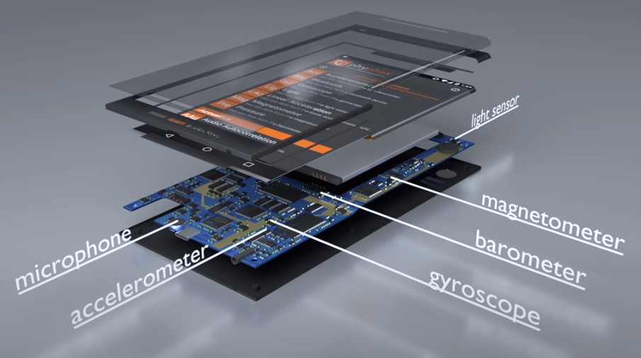
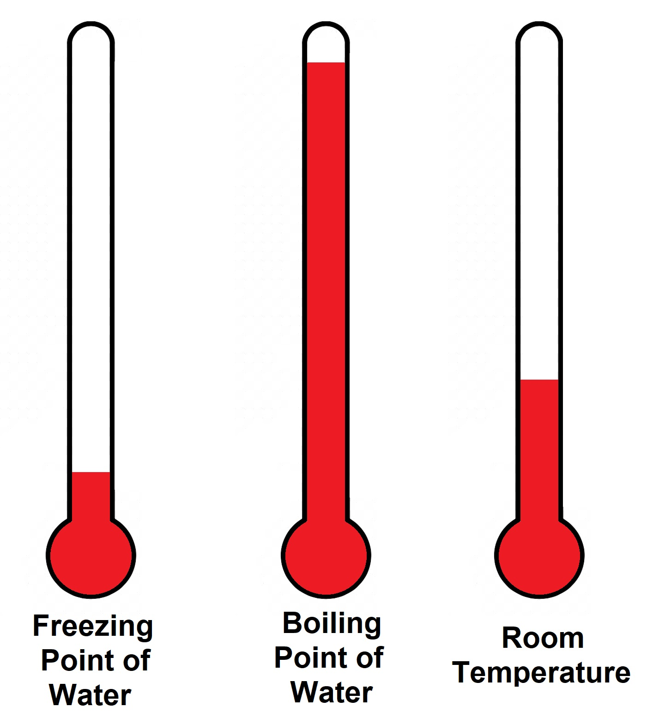
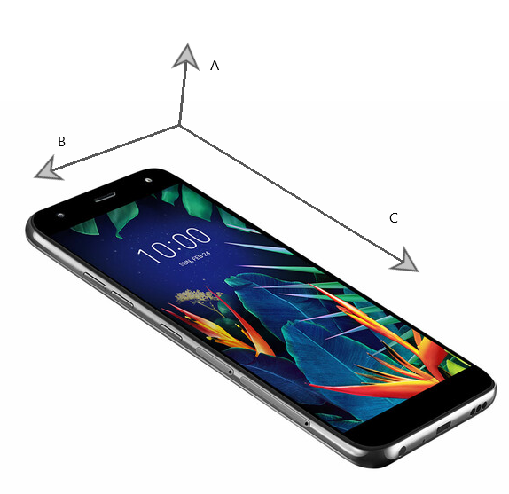
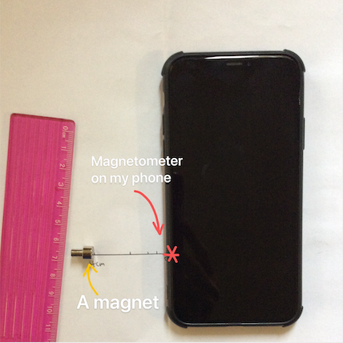

# Lab 0: Learning to use Phyphox

:::Materials 
- [c] Your phone with the Phyphox App installed
  - See instructions in Part I
- [c] A magnet
- [c] Ruler
- [c] Steel screw
:::

# The Phyphox App

:::RFigure Phyphox m

The Phyphox Phone App
:::

In this intro lab, we will learn how to use the Phyphox app to acquire data that we will later analyze. You can download the app from the [Phyphox website](https://Phyphox.org/) or find it in the iOS/Google Play store. 

Phyphox allows you to use the sensors in your phone to measure quantities such as frequency, acceleration, and magnetic field strength. It also includes some additional modules with special functionality, such as acoustic stopwatches. Data can be exported in many common formats for quantitative analysis. Additionally, Phyphox on the phone can be controlled remotely from your desktop as long as they are on the same Wi-Fi network.

You are encouraged to play with Phyphox, explore its capabilities and the experiment ideas on the website, and take creative license with your investigations throughout the course. The instructions provided in each lab can be seen as a "minimum" requirement — the features of Phyphox go far beyond these suggestions. For example, you can try your hand at coding and making your own sensors by using the Phyphox API.

# Experiments
We will get familiar with the Phyphox app by investigating the external magnetic field of a magnet with your phone's magnetometer — this is a device which is sensitive to the *strength* and *direction* of a magnetic field at its specific location. 
However, before we can begin collecting data to characterize magnets, we need to know where the magnetometer actually is! If we do not know the exact location of the magnetometer, it is difficult to make sense of magnetic field readings whose strength & direction vary with measurement distance! 

::: LFigure typical-phone s

A Typical Phone with a vast array of sensors. Click on the image above to expand the view.
:::

 [Fi](#Fi-typical-phone) shows an image of a "typical" phone with a multitude of sensors. Unfortunately, this layout varies among device brands, models and even *versions* as increasingly innovative integrated circuit boards are manufactured. Moreover, to make things worse for us, it is typically very difficult to find schematics for most phones! Our first task is, then, to find the location of the magnetometer on our phone by brute force: literally moving a magnetized object around it to see where the reading will peak. 

After we find the exact location of the magnetometer, we will explore how Phyphox allows us to take *calibrated* and *uncalibrated* data, and which type to use in our experiments. Lastly, remember to subtract the background noise from the measurements before you move on to the data analysis. 

:::Note
For  experiments, be mindful of the environment you are working in! An appropriate location may be a room with minimal electronic devices, or on top of a wooden/nonmetallic table. Be sure to remove any magnets and metals from the experiment area to minimize external fields.
:::

## 1. Get to know your magnetometer

::: Materials
- [c] Your phone with Phyphox
- [c] A magnet
- [c] Steel screw
:::

Since we know that the field of a magnet is strongest near its poles, we will run a magnetized object around the phone to pinpoint where the reading is highest. It’s never in the center of the device, so you can’t make an accurate measurement just by moving a magnetic source toward or away from the face of your phone.  Usually, the magnetometer is located somewhere at the edge of the phone, and its exact location depends on the brand and model.

As mentioned in the note above, metallic objects around your phone may affect the reading you get. Nearby metal and magnets may make it difficult to pinpoint the magnetometer location, and are likely to interfere with future experiments that require quantitative data.

::: Question
Why would metal interfere with the calculation of magnetic field?
:::

You are now ready to begin [Ex](#Ex-mag-locate). Click on the arrow to expand the instructions.

:::::: Exercise mag-locate
Instructions for labs in this course will be in "exercise" boxes such as this one, with numbered steps to help you navigate the procedure. The easiest way to complete these labs successfully is to tackle each step in order, taking observational notes on each numbered step so that you have a record of what you've done for your final write-up.

We will now describe the process you will  use to find the location of the magnetometer:
1. Find a steel screw (or another small object that can be magnetized, like a paperclip) and a magnet, and magnetize the screw by rubbing it with the permanent magnet.
2. Remove the magnet from your experiment area.
3. Move the tip across the surface of your phone until you get a strong reading as it reaches the magnetometer.
4. Optional: Since you will need to know this location for future labs, feel free to mark it with, for example, a small piece of tape.

:::Note
 The magnetometer in your phone is extremely sensitive because it is designed to be used as a compass. It can easily resolve 50 µT, but it also saturates at few mT.  If you are using a neodymium magnet rather than a magnetized screw, it might easily saturate the sensor because of its strong fields. Make sure that the magnet is either weak enough (or far enough) from the sensor that the field strength stays below 2 mT.
:::

::::::

## 2. To calibrate or not to calibrate? 

Now that we have found the location of the magnetometer, the next step is to gain a working knowledge of its features. On Phyphox, you can see that (depending on the model of your phone) the magnetometer has a *calibrated* and *uncalibrated* mode. Before we discuss which mode is appropriate for our experiments, let's first cover the concept of calibration.

The process of calibration allows us to quantify a measurement of some *physical quantity* as a *number* (or set of numbers) that have meaning **relative** to some known, or universal, standard. The standard you are calibrating against can depend on the specific context of your experiment, or the physical characteristics of your measurement instrument.

::::::Hider Examples of Calibration: Click to read more

- @fa-chevron-right@ Cheap analogue kitchen scales have a weighing platform elevated from the base by a spring. The platform is attached to a rack and pinion gear that physically rotates an indicator needle on the front of the machine. The markings on the front are calibrated by measuring standard masses and creating a numerical scale that matches these known locations. 
:::Figure scales l

:::
- @fa-chevron-right@ Spectrometers, which separate and measure the components of light, are calibrated by making a measurement of a sample with peaks of known wavelength. A common choice for calibration is the mercury emission spectrum as it contains a doublet that allows one to estimate both the location *and* scale of incident light. 
- 
::::::

:::::: Question
Imagine the following scenario:

:::RFigure temps l

:::
You are in the lab and need to know the room temperature for an experiment. After shuffling through the drawers, the only thermometer you can find is an old mercury thermometer who's markings have worn off. Being as clever as you are, you realize that you can calibrate the thermometer by measuring the freezing point and boiling point of water.   

Using a ruler on your screen to calibrate the measurement, click on the image to the right and determine the temperature of the room in Celsius. Be sure to describe how you obtained your final result.
::::::

Calibration is very useful when it is applied appropriately. However, in our case, your phone is attempting to calibrate itself under the assumption that the only magnetic field that is present is Earth's (which is clearly not the case when experimenting with magnets)! The reason phones do this is because the primary function of the magnetometer is actually the compass/maps app on your phone: if your phone is exposed to a strong magnetic field, part of your device's integrated circuit might become magnetized, leaving your compass pointing in the complete wrong direction.
:::RFigure calibration xl

An example of bringing a magnet close to my phone's magnetometer. In calibrated mode, you can see that the phone is attempting to correct the field based on the phone's gyroscope, assuming that the additional magnetic field detected is from an accidentally magnetized component, giving me an artificially decreasing field. In the uncalibrated mode, the phone's magnetometer reading does not self-adjust.
:::
How and when is your phone applying calibration, exactly? Unlike devices such as scales and thermometers, the phone is constantly calibrating itself: since the magnetometer is very sensitive, any kind of unwanted magnetization will affect your measurements — unfortunately, your phone is full of things that create magnetic fields and that can be easily magnetized [fn] This is why the magnetometer is usually at the edge — to isolate it as much as possible [/fn]. While the method varies slightly between devices, in general it should look quite similar to this:

1. Assume that the only external magnetic field is Earth's magnetic field (who's magnitude is around $50$mT).
2. Use the gyroscope to determine the phone's orientation, and the components of Earth's field that should be measured
3. Using the magnetometer, obtain a signal that represents the strength of the total magnetic field.
3. Assume that the *internal* magnetization of the phone is the difference between the measurement and Earth's field, and try to correct the reading toward this value.

 
 
 

The easiest way to get a feel for how your phones calibration (or lack there of) may affect your data is simply to play with it. In the next exercise, we will carefully bring a stronger magnetic field close to the magnetometer and see how the phone reacts in both calibrated and uncalibrated modes.

:::::: Exercise 
We will now make a magnetometer measurement by putting the magnet somewhere around your phone. Make sure the absolute field strength is 100 µT or more. Then you can rotate the phone about every axis while measuring, and if your phone applies a calibration to the reading, at some point the readings will suddenly drop (usually to around 50 µT, sometimes less). 

During calibration, the magnetometer uses the Earth's magnetic field in conjunction with its gyroscope to determine the relative orientation of its sensors. Since the $x$, $y$ and $z$ directions are mutually orthogonal, it analyzes how rotation along each of these axes affects the sensor measurement, to determine how these axes are aligned relative to the device. 

::: Question
Try this exercise in both calibrated and uncalibrated mode and then answer the following questions. If you phone does not have one of these modes, please do it for whichever it does have [fn]Your response to this question will help the TAs assess your work in this and future experiments that use the magnetometer[/fn]
:::
1. Attach a screenshot and a brief description of what happens when bringing a magnet close to your phone in calibrated and uncalibrated mode.
2. Which mode do you think you should use to measure magnetic fields with the most accuracy in this course? If you only have one mode, comment on the accuracy you think this mode has and why.
::::::

## 3. Measure the direction and strength of a magnetic field with Phyphox

::: Materials
- [c] Your phone with Phyphox
- [c] A magnet
:::

####

 

In [Ex](#Ex-strengthanddirection), the magnet will provide an external magnetic field. Our first task is to characterize the magnet by measuring the *direction* of this field. Later, we will take care of the background noise to measure the *magnitude*.

:::::: Exercise strengthanddirection
First, let's identify the axes and directions of your magnetometer:
####

**Axis Determination Steps**
1. Open Phyphox and go to the "magnetometer" module.  You can see that there are three plots, representing $B_x$,  $B_y$ and $B_z$.
2. Identify which direction is geographic north in your room.
3. Rotate your phone so each of the three primary axes (short, medium, long) of your phone is aligned with geographic north [fn] Don't be alarmed if there are other nonzero components when your phone is facing geographic north! The magnetic field at a particular location actually fluctuates in inclination and direction a little. If you want to know precisely where the magnetic field points, you can look it up at on [NOAA](https://www.ngdc.noaa.gov/geomag/calculators/magcalc.shtml)[/fn]. 
4. Take note of which axis has the highest absolute reading — this specifies the axis of the magnetometer aligned with north.
####

:::Figure magnor s

####
Hyperphysics: The magnetic north pole is the geographic south pole!
:::

**Direction Determination Steps**
1. The $z$ direction of your magnetometer likely runs out of the face of your phone, so we will first test the sign of this axis.
2. Rotate your phone so that the back of it is facing geographic north.
3. If the reading is negative, the axis is defined so that the positive direction points *out of your phone screen*. You can understand this by imagining an arrow pointing from geographic south to geographic north.
4. Repeat for the remaining axes.

Now let's measure the direction of magnetic field from the  magnet.

**Measurement steps:**
1. Put your phone on the table, open the Phyphox app and go to “magnetometer.”
2. Start recording. You should see some random fluctuations on the plot. 
3. Hold the magnet above the magnetomer, with one flat side facing up. Move it up and down above the magnetometer.
4.  Now flip the magnet over, and repeat the motion.
5.  Stop recording to view the collected data. 

::: Question
1. Identify the axis name and sign in [Fi](#Fi-phonaxes) for your phone. [fn]Your response to this question will help the TAs assess your work in this and future experiments that use the magnetometer[/fn]
2. Why does $B_z$ change when you move the magnet vertically?
3. Describe the change you observed in the plot after you flipped the magnet, and give a possible explanation.

:::

::: Figure phonaxes m

:::

By observing how $B_z$ changes with the vertical motion of the magnet, you should be able to identify the direction of the magnetic field. Mark one side with “⨂” to indicate that the magnetic field is going into that side, and the other side with “⨀” to indicate that the field is coming out of this side. You will use these magnets for other labs this quarter.

::: Question
 Explain how you determined the magnet's polarity from your data, *i.e.*, how you decided which sides represent the magnet's north (⨀) and south (⨂) poles. 
:::

::::::

## 4. Measure the field around a magnetic source
:::Materials
- [c] Your phone
- [c] A magnet
- [c] Ruler
- [c] Steel screw
:::

In [Ex](#Ex-strengthanddirection), we asked you to identify the poles of your permanent magnet and make some qualitative observations about how field strength behaves as you move the magnet above the magnetometer. 
:::RFigure bar_magnet xs
  
:::
We will now make a more quantitative measurement of the field surrounding the magnet. Unlike electric charges, magnetic charges do not exist as "monopoles" with a spherically symmetric magnetic-field, in our universe [fn] At least as far as we know! See [Wikipedia](https://en.wikipedia.org/wiki/Magnetic_monopole#Searches_for_magnetic_monopoles)[/fn]; the poles must always come in equal and opposite pairs, and the surrounding field is therefore changed. 

Permanent magnets themselves are made of ~$10^{24}$ tiny atomic dipoles, and hence their measurable fields are actually the sum of all of these individual contributions. The size and geometry of a magnet, therefore, ultimately determine the character of its field.

Measurements of disk and bar-like magnets from close (but not *too* close) distances reveal that the field is approximately dipolar itself, as shown in [Fi](#Fi-bar_magnet). However, despite the "dipole" (and higher order, *e.g.* "quadrupole") contributions to the field from the magnet's shape, along the axis that runs through the poles of a magnet, the field behaves much like a "monopole"— similar to the electric field of a single electric charge. In this experiment, we will investigate how the magnetic field along the axis running through the center of your neodymium magnet disk behaves as a function of distance.

::: Question

1. Theoretically, how might the strength of the magnetic field (along your magnet's $z$-axis) depend on distance from the source? Your answer should be written as a proportionality, $B(r)\propto...$.  (You don't need to specify the proportionality constant.)

2. Devise a quick experiment that could verify this, and sketch a plot of the expected result. 

3.  Based on the relationship between strength and distance proposed in (a), say that you doubled the distance from $r$ to $2 r$.  How would this change the resulting field strength?
:::

:::::: Exercise
As your final exercise in getting familiar with the magnetometer, you will attempt to verify your prediction quantitatively.

It should be emphasized that since we are using the uncalibrated magnetometer, you have to manually calibrate it by **subtracting the background** from the measurements. The background includes Earth's magnetic field and local fields from nearby electronic devices and metals.

:::Note
 Be careful! Do not to move or rotate your phone between data aquisitions, because this would change the background contribution.
:::

####

**Magnetic Force and Distance steps:**
1. Mark 0.0 cm, 0.5 cm, 1.0 cm, 2.0 cm, and 4.0 cm on a piece of paper. Align the edge of your phone nearest to the magnetometer with the 0 cm mark
2. Start a measurement without the magnet (place the magnet far from your work area) and record the values. 
3. Magnetize a steel screw and align it with the 0.5 cm mark.
4. Record about 1 second of data and stop.
5. Double the distance to 1 cm, 2 cm, 4 cm, and record 1 second of data each.
6. Export the data. For each measurement made above, calculate the average of the 1-second interval, and record the average field strength and the distance of the measurement in a table.
:::Figure

:::

:::Question 
For each doubling, calculate the ratio of the magnetic field $B(2r)/B(r).$ You should have three ratios for 4 data points.

1. Do the ratios match your expectations from Question 6c? 

2. Do some ratios match better than others?

3. Propose an explanation for part (b). Consider things such as the nature of the magnetic field (Should the measurement be more accurate closer to or farther from the device?), as well as experimental corrections like the exact location of the magnetometer (Is it exactly at where you labeled? What effect might an offset have on your data?).
:::
::::::
# Write-up

###  **@fa-hand-o-right@  Instructions :**
 #### **1. Answer all questions clearly, showing your work where appropriate.**
 #### **2. Starting on a seperate page:** 
  - Write a short summary (~1 page, single spaced) describing the important concepts of the lab, what you did, and any important observations. 
  - In this summary, be sure to **summarize your results** and **reasons why you believe your data are precise and accurate**. If you do not think your data are accurate, explain why, and how this could be fixed in a future lab.

 #### **3. Additional Information:**
 - You should attach images of your plots,  data, and setup.  Doing so may allow you to regain partial or full credit even if your experiment fails.
 

::::::Summary

::: Hider Lab Submission
<iframe id="contentframe" height="500px" width="100%" src="https://gauchospace.ucsb.edu/courses/mod/lti/launch.php?id=6624857&triggerview=0" allow="microphone https://coursekit.google.com; camera https://coursekit.google.com; geolocation https://coursekit.google.com; midi https://coursekit.google.com; encrypted-media https://coursekit.google.com; autoplay https://coursekit.google.com" allowfullscreen="1" style="height: 500px;"></iframe>

::::::

# Feedback

Any feedback you choose to give will be used to improve labs this quarter!
::: Hider Open Feedback Form
<iframe src="https://docs.google.com/forms/d/e/1FAIpQLSe2iC82MmPLFP68-xLMjPB7uPyILy-vsdUs0tqxweXhsA9YcQ/viewform?embedded=true" width="100%" height="1000" frameborder="0" marginheight="0" marginwidth="0">Loading…</iframe>
:::

 
 
 
 