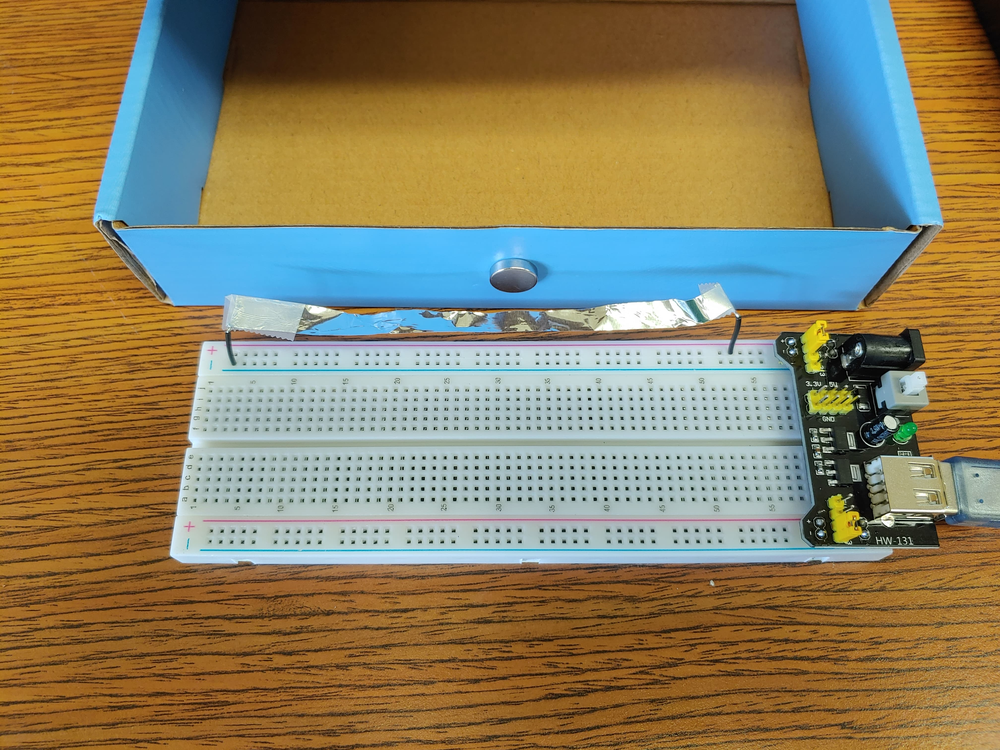
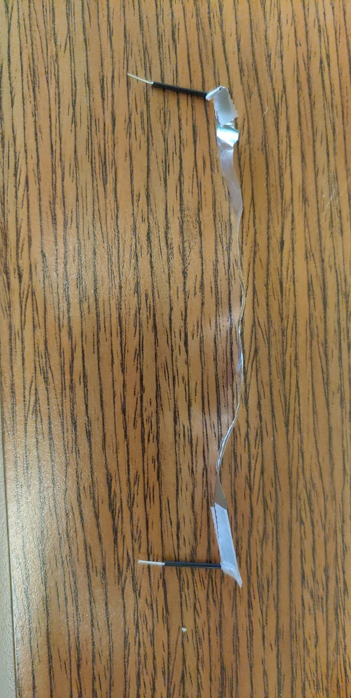
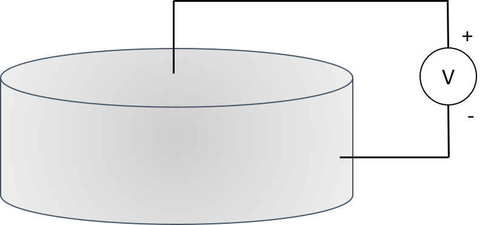
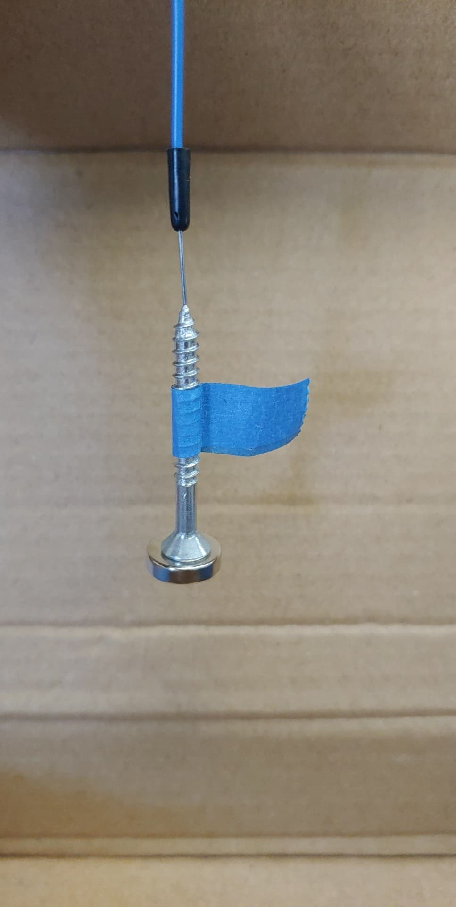
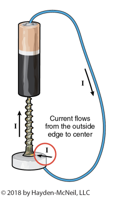

# Lab 1: Magnetic Force

::: Materials
- [c] Two or more magnets
- [c] Two short wire jumpers (kit)
- [c] Two medium wires (kit)
- [c] Circuit Power Block and Breadboard (kit)
- [c] Strip of Aluminum foil
- [c] Tape 
- [c] Cardboard for support, *e.g.*, the circuit kit box
:::

# The Lorentz Force

By this point in your physics career, you are familiar with the ideas of electrostatics &ndash; the mathematical descriptions of forces and fields that act on and are generated by charged particles at rest. This quarter, you will develop a deeper understanding of magnetism, and hence *electrodynamics*, which are the laws of physics that govern *moving* charges. 

Perhaps the most important equation you will encounter in this course will be the Lorentz force law:

:::Equation 
$$
\vec F = q (\vec E+\vec v \times \vec B)
$$
:::

which describes the force, $\vec F$, that acts on a charge, $q$, moving with a velocity $\vec v$ in the presence of electric and magnetic fields, $\vec E$ and $\vec B$ respectively. This relation is immensely important not only to foundational physics, but also to electrical engineering and various scientific applications: it allows the creation of motors, mass spectrometers, particle detectors and accelerators like the LHC. For the aspiring theorist, this force law should be intrinsically interesting: it’s the origin of some deep, unsolved mysteries of quantum electrodynamics [fn] The Lorentz Force, when analyzed for a point charge, results in a strange paradox that predicts &ldquo;signals from the future&rdquo; causing spontaneous acceleration of particles. Despite this being an equation from Classical Electrodynamics, the problem persists into Quantum Electrodynamics without a well-accepted solution. Surprisingly, the current perspective assumes that electroweak unification is necessary to resolve the paradox.  (See [wikipedia](https://en.wikipedia.org/wiki/Abraham%E2%80%93Lorentz_force#Signals_from_the_future) for more information.)[/fn]. For these reasons, our first lab will be a real, tangible investigation of this mysterious force law.

For the purpose of this laboratory experiment, we are concerned with the force in the absence of an external electric field, $\vec E = 0$, so our equation will read:

::: Equation
$$
\vec F = q (\vec v \times \vec B)
$$
:::

This equation gives us two independent and important pieces of information, namely the *direction* and *magnitude* of the resulting force. 

:::LFigure rhr s

::: 
The direction can be determined by means of the so-called &ldquo;right-hand rule,&rdquo; shown in [Fi](#Fi-rhr). The right-hand rule is a mnemonic device for quickly working out the direction of a cross product: If you extend the index and middle fingers of your right hand in the directions of the first and second vectors in the product, respectively, your extended thumb points in the direction of the resultant.

Aside from the *direction*, we also need to know about the *strength*. The magnitude of the product depends, of course, on the magnitudes of the original vectors, but also on the *angle* between the two vectors:

:::Equation
$$
F(\theta)= q |v||B|\sin(\theta)
$$
:::

When they are completely perpendicular, the result is simply $F(\pi/2) = q |v||B|$, and when they are aligned in exactly the same direction we have $F(0)=0$.

Vector equations, if they are new to you, take some getting used to. In plain English, the Lorentz force law tells us the following: A charged particle moving with a velocity $\vec v$ perpendicular to a magnetic field $\vec B$ experiences a force in a direction that is perpendicular to both of these vectors, which has a magnitude proportional to their product. So you can get a feeling for how this works, [Si](#Si-LF) shows the motion of a charged particle in the $xy-$plane when it is subjected to a magnetic field along the $z-$axis.

:::Simulation LF
<embed src="https://kapawlak.github.io/PhDemoJS/Apps/LorentzForce/LorentzForce.html" width='100%' height='820px'>
:::

:::Question
Look at [Fi](#Fi-rhr), and answer the following short questions. You can click the image to enlarge it.
1. What happens to the direction of the resultant vector if you accidentally reverse the fingers associated with $\vec a$ and $\vec b$? 
2. What happens to the direction of the resultant vector if you use your left hand instead? 
3. What is the difference in *magnitude* of $\vec a \times \vec b$ and $\vec b \times \vec a$ ?
4. What is the difference in *sign* of $\vec a \times \vec b$ and $\vec b \times \vec a$ ?
:::

# Experiments
## 1. Overview
This week we will study the force experienced by moving electrons in a magnetic field. We have the following goals:

   1. Use the right-hand rule to determine the direction of the magnetic force due to the presence of a magnetic field. 

   2. Match the predictions of the magnetic force direction to observations.

   3. Demonstrate that the Lorentz force can be converted into mechanical work by constructing a simple motor

## 2. Force on a current-carrying &ldquo;wire&rdquo; near a magnet
:::Materials
- [c] Two or more magnets
- [c] Two short jumper wires (kit)
- [c] Circuit Power Block and Breadboard (kit)
- [c] Thin strip of Aluminum foil, approximately 10-15 cm long
- [c] Tape
- [c] Cardboard, *e.g.* circuit kit box
:::

Most of us don&rsquo;t have access to beams of charged  particles in free space (or methods to observe them easily), which makes a demonstration of Lorentz&rsquo;s force law similar to the simulation above quite impossible. Luckily for us, the force law is ubiquitous, and equally applies to the moving electrons in *materials* &ndash; such as current-carrying wires.

In a wire, a current is carried by many electrons moving along its length because of the voltage difference between its ends.  Recall that in this case,

:::Equation
$$
\vec I = q_e n A\vec v 
$$
::: 

where $n$ is the number of electrons per unit volume, $q_e$ is the charge of an electron,  $A$ is the cross sectional area of the wire, and $\vec v$ is the electron drift velocity. When a current-carrying wire is brought close to a magnetic field source, these electrons will be subject to the Lorentz force, whose magnitude and direction is determined by the electron velocities and the external magnetic field. In the following experiment, you will demonstrate and verify the Lorentz force by generating a current though a wire and observing the effect of a magnetic field.

:::Question
1. Sketch a picture of a simple wire with a voltage difference across its length, indicating the $+$ and $-$ ends explicitly.  Draw an arrow indicating the direction of the current.

2. In what direction does the velocity vector, $\vec v$, point? Draw an arrow indicating this direction. (Recall the charge of the electron.)
:::

:::::: Exercise
In this experiment, we will fix a strip of aluminum foil, which behaves as a &ldquo;wire&rdquo;, so that it runs perpendicular to the field generated by our magnet. When you connect the foil to the terminals of your breadboard, so that a current is generated, you will observe and record the effects of the Lorentz force, and explain if it matches your expectations based on the &ldquo;right-hand rule.&rdquo; The reason for using foil is its thickness &ndash; it is much easier to observe bending in foil vs. stiffer wire.
:::Figure foilbox m
  

  Example of the setup. The foil runs 

  perpendicular to the magnet&rsquo;s $\vec B$ field. 
:::
***Foil Circuit:***
1. On each end of the aluminum foil strip, wrap it around the short wire jumpers and tape to secure, leaving a few cm of foil. 
:::Figure foilwrap m
  

  Wrap the foil around the leads and tape to secure. 
:::
2. Insert this into the breadboard, with the leads going into + and - terminals on the 5-V power lines. Be sure to bend the tips of the leads so that the flat face of the foil is pointing up and down, as in [Fi](#Fi-foilbox).
3. Taking your cardboard support, place one magnet on either side of the foil so that they hold their place. Adjust their height to be level with the foil from the previous step. Make sure your magnets&rsquo; poles have been labeled!
:::RFigure foilmove m
  

  The foil moving "up".
:::
4. Plug your powerblock into your laptop or a USB charger.
5. Press the button on your powerblock to allow current to flow.
6. Note the direction in which the foil moves, and **press the button again to prevent the circuit from overheating**.
:::Warning
Leaving the power on will make things get very hot, and you risk burning yourself or damaging the powerblock. Make sure to turn the power off after your measurement.
:::
7. Record the orientation of the magnet and the direction of the current (based on which leads are plugged into the + and - terminals), as well as the direction of motion of the foil.
8. Repeat this experiment for all four combinations of magnet orientation and current direction. Make a table similar to the following to record your results for each magnet and battery orientation, the prediction for the force direction given by the right hand rule and the observed direction of foil movement:
:::Table
| Magnet Orientation | Battery Orientation | RHR |Foil Direction |
| --------  | --------      | --------     |--------     |
| (N/S) toward foil  |    (+/-) up   |  (up/down)    |           (up/down)    |               
|$ $         |               |              |          |
|$ $         |               |              |           |
|$ $         |               |              |           |
|$ $         |               |              |           |
:::

::: Question
Along with your table, include an image of each trial. Include arrows to show the direction of the magnetic field, labels to indicate the voltage applied and direction of current flow, and the resultant force given by the right-hand rule.
:::

######

::: Question
1. Are your observations consistent with the right-hand rule?

2. How does the motion of the foil change after you switch the battery orientation? Why?
:::

:::Question
The Lorentz force acts on the electrons in the foil. Try to explain why the *entire* foil moves, and not just the electrons.
:::
::::::

:::Hider Mini FAQ for Exercise 1
- **Q:** My observations don&rsquo;t match the RHR!
  - Did you record the current direction correctly? 
  - Is your power block installed upside down so that the + and - terminals are connected to the wrong power rails?
  - Did you misidentify the polarity of your magnets?
  ####

- **Q:** My foil doesn&rsquo;t move enough to see the direction!
  - Make sure you are using the 5-V power terminals for the largest effect!
  - Adding more magnets to your stack will increase the strength of the interaction.
  - If the foil is pulled too stiff, it will not be able to overcome the tension to bend. Try loosening it.
  - Similarly, if the foil is too loose, it will just rattle around randomly. Try to find the sweet spot using [Fi](#Fi-foilmove) as a reference.
:::

## 3. The Rotating Motor
::: Materials
- [c] A magnet
- [c] Medium Wire Leads, one magnetic, one non magnetic (kit)
- [c] Power Block
- [c] One steel screw
- [c] Cardboard (optional)
- [c] Alternate setup: One long wire, screw, and an AA or AAA cell
:::

In this setup, we will be creating a simple homopolar motor. Homopolar motors, first constructed by Michael Faraday in 1821, prior to the discovery of electromagnetism, operate by means of the Lorentz force: A conductor with a current flowing through it, when placed in a magnetic field that is perpendicular to the current, feels a force in the direction perpendicular to both the magnetic field and the current. This force provides a torque around the axis of rotation.

In this exercise we will construct this direct-current (DC) motor using a battery as our voltage source, and our neodymium magnet as the conductor and perpendicular field source. The magnet will be connected with the battery by means of a screw, whose sharp point has minimal friction and allows for free rotation. When wire leads are used to close the circuit, the current running from the magnet’s outer surface to the screw at its center, in conjunction with the magnetic field, will result in a force on the moving *electrons* inside the magnet, causing it to rotate rapidly!

:::Question

The above image shows a disk with a conductive surface (inside is an insulator) connected to a circuit with current $I$. Sketch the path that electrons might take, including the path on or inside the disk, with arrows indicating the direction of the velocity. (You can copy this image into your Google doc)
:::

By noting the direction in which the current is flowing, as well as the direction of the field of the magnets (found in Lab 0 and verified in the previous exercise), we can apply the right-hand rule to determine the direction of the magnetic force, and verify that our results are consistent with the observed direction of rotation.

:::::: Exercise
With the knowledge of the magnet&rsquo;s orientation from the previous lab, we will now construct a simple homopolar motor by following these steps:

:::Figure screwbox m
  

 My setup. Click for details. 
:::

***Homopolar Motor Construction:***
:::RFigure magnetized m

Screw Hangs
:::
1. Identify the magnetic wire in your kit (it has rounded tips) and plug it into the + side of the power rail. 

2. Place the flat head of your screw on top of the neodymium magnet, with the north (⨀) pole facing upward. 
3. The screw should now also be magnetized so that touching your magnetic wire to it picks up both the screw and the magnet.
4. Attach the nonmagnetic jumper wire (no black tips) into the - side of the power rail.
5. Optional: Push the magnetic wire through a peice of cardboard to hold it in place, making the experiment easier to fiddle with. Also feel free to tape a "flag" to your screw so seeing the rotation direction is easier.
6. Touch the nonmagnetic jumper wire to the edge of your magnet. The screw should start rotating. It might take a few times to get this right!
7. Record your setup and the direction of spin.
::: LFigure screwspin m

Success!
:::

You have now completed the motor setup for one of four possible orientations of the magnet and battery. Recall from our previous discussion that when these fields are perpendicular, $F= q vB= I L B$, and the direction of the force is given by the right-hand rule. Because this current is localized to the region of the magnet connecting the wire to the nail, the force acting upon  the individual electrons results in a torque that spins the entire magnet. You will use the right-hand rule to predict the direction that the magnet will spin based upon the orientation of both the battery and the magnet.

Make a table like the one below and record your results for all four possible combinations of your battery and magnet orientations, prediction based on the right hand rule (RHR), and the observed direction of rotation:

:::Table
| Magnet Orientation | Current Direction | RHR|Rotation Direction |
| --------  | --------      | --------     |--------     |
| (N/S) up  |    (+/-) up   | (CW/CCW)  | (CW/CCW)    |                    
|@fa-pencil@          |               |              |  |
|@fa-pencil@         |               |              | |
|@fa-pencil@        |               |              | |
|@fa-pencil@         |               |              | |
:::

::: Question
Along with your table, include an image of each trial. Include arrows to show the direction of the magnetic field, labels to indicate the voltage applied and direction of current flow, and the resultant force given by the right-hand rule.
:::

::::::
::::::Hider Alternate set-up with battery
1. Place the flat head of your screw on top of the neodymium magnet, with the north (⨀) pole facing upward. The screw should now also be magnetized so that picking it up also picks up the magnet beneath it.
2. Holding the battery in the air with the positive terminal facing up, touch the negative terminal to the pointed end of the screw. The magnetization should allow you to pick up the screw + magnet by lifting the battery.
3. Hold one end of your exposed wire against the battery’s positive terminal.
4. Once everything is connected, gently touch the other end of the wire lead to the side of the magnet (*i.e.*, perpendicular to the magnet’s surface)
5. If you do this correctly, the screw should rotate.

::: Figure

:::
::::::

:::Hider Mini FAQ for Exercise 2
- **Q:** My observations don&rsquo;t match the RHR!
  - Did you record the current direction correctly? 
  - Is your power block installed upside down so that the + and - terminals are connected to the wrong power rails?
  - Did you misidentify the polarity of your magnets?
  ####

- **Q:** My magnet/screw doesn&rsquo;t rotate!
  - The most common cause of this is friction. I have found that balancing the screw on the side of the wire end, rather than directly on the tip as in [Fi](#Fi-magnetized) reduces friction. Also try to touch the side of the magnet with the wire as lightly as possible to reduce friction.
  - Make sure you are using the 5-V power terminals for the largest effect!
  - Adding more magnets to your stack will increase the strength of the interaction
:::

# Write-up

###  **@fa-hand-o-right@  Instructions :**
 #### **1. Answer all questions clearly, showing your work where appropriate.**
 #### **2. Starting on a seperate page:** 
  - Write a short summary (~1 page, single spaced) describing the right-hand rule, how you tested it, and any important observations. 
  - In this summary, be sure to **summarize your results** and **reasons why you believe your data are precise and accurate**. If you do not think your data are accurate, explain why, and how this could be fixed in a future lab.

 #### **3. Additional Information:**
 - You should attach images of your plots, data, and setup.  Doing so may allow you to regain partial or full credit even if your experiment fails.
 
 ::::::Summary
 :::Hider Lab Submission
  <iframe id="contentframe" width="100%" src="https://gauchospace.ucsb.edu/courses/mod/lti/launch.php?id=6002332" allow="microphone https://coursekit.google.com; camera https://coursekit.google.com; geolocation https://coursekit.google.com; midi https://coursekit.google.com; encrypted-media https://coursekit.google.com;" allowfullscreen="1" style="height: 500px;"></iframe>
 :::
 ::::::

# Feedback

Any feedback you choose to give will be used to improve labs this quarter! Feedback is not required on all questions. If you&rsquo;d like just to leave some comments, scroll to the bottom of the form.
::: Hider Open Feedback Form
<iframe src="https://docs.google.com/forms/d/e/1FAIpQLSd6emUXMkONPOrSeLX6Ud_CFF7H1B9NGXmdxhlqx8JCijFXUA/viewform?embedded=true" width="100%" height="1000" frameborder="0" marginheight="0" marginwidth="0">Loading…</iframe>
:::

 
 
 
 