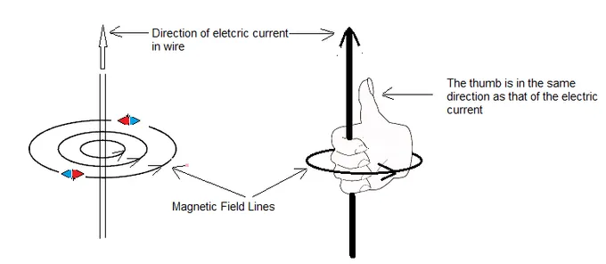
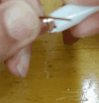
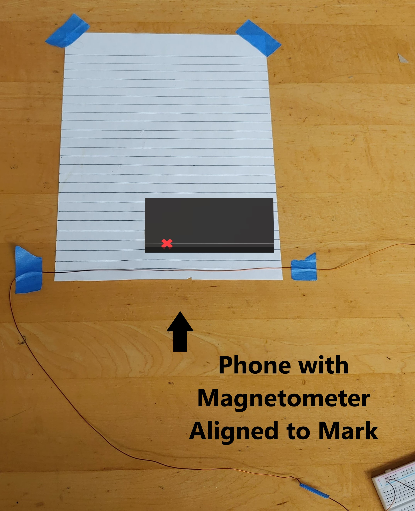
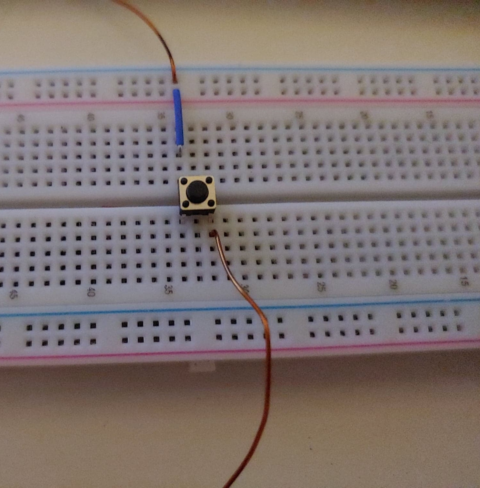
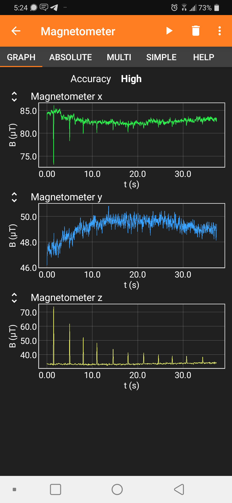
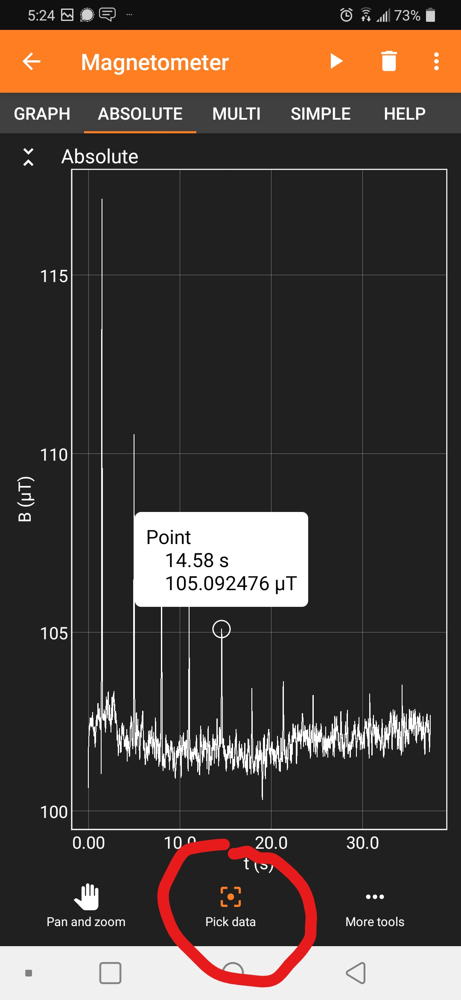
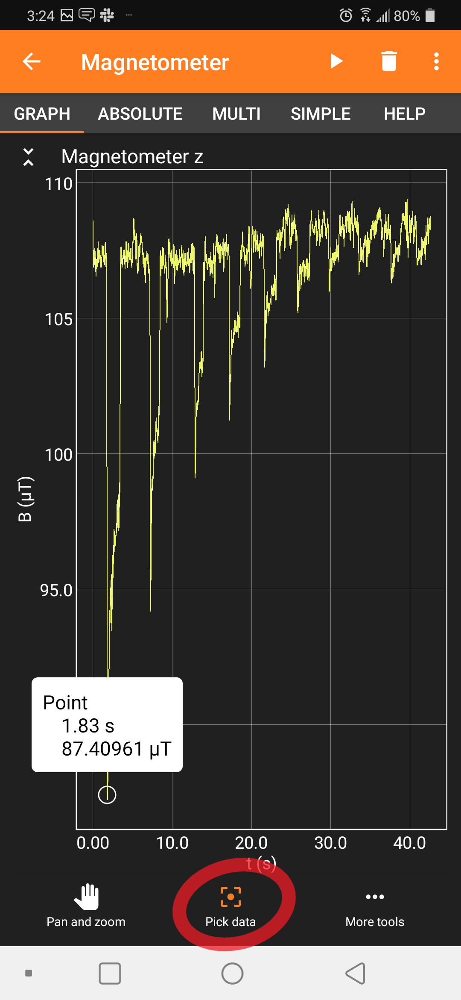
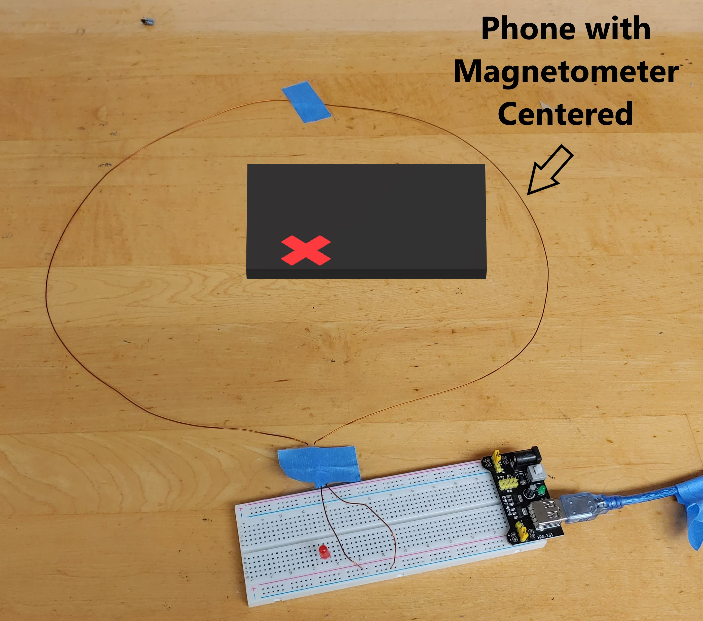

# Lab 2: Magnetic Field

::: Materials
- [c] Your Phone with Phyphox
- [c] Long insulated wire (~0.8-1 m)
- [c] Circuit Power Block and Breadboard (kit)
- [c] Paper and ruler
- [c] Optional: Button component from RexQualis kit
:::

# The Biot-Savart Law

In the previous lab, we looked at how moving electric charges feel force in the presence of external magnetic fields. Continuing with the theme of electrodynamics, we will look at the fields and forces *caused* by moving charges *themselves*.

As you may know, moving charges not only have electric fields, $\vec E$, associated with them, but also produce magnetic fields, $\vec B$, in directions tangent to their velocity. The characterization of such $\vec B$ fields for a single moving charged particle is actually trickier than you would expect &ndash; the motion of the point-like charged particle and constant generation of a magnetic field at every point in time requires relativity to describe correctly &ndash; and will be dealt with in a more advanced course.

It turns out, however, that a *line* of moving charges, such as a current-carrying wire, is much simpler to work with; the resulting magnetic field has a static and well-defined description in terms of the Biot-Savart Law:

:::Equation biot_law

$$
\vec B = -\frac{\mu_0 I}{4\pi} \int_C    \frac{\vec r \times d\vec\ell }{|\vec r|^3}
$$

:::

In this lab, we will explore the Biot-Savart law by indirectly determining *the current* in a wire by *measuring the magnetic field*  it produces. We will focus on two simple setups &ndash; a long straight wire and a loop of current, whose integrals result in a simple expression for the magnetic field.

## Long Straight Wire

::: Simulation long-straight
<iframe src="https://kapawlak.github.io/PhDemoJS/Apps/BiotSavart_Current_Line/Biot_Savart.html" width= "100%" height="800" style="border:none;"></iframe>
:::

::: RFigure RHR xs

:::

For a long straight wire carrying a current, the magnetic field wraps around the line of current according to the right-hand rule, as shown in [Fi](#Fi-RHR). The strength of the measured field depends on the *current* passing through the wire and the *distance* from the wire at which you take a measurement. A qualitative, interactive example of this is given in [Si](#Si-long-straight).

To get a quantitative picture, we must apply some calculus. By analyzing the integral of the [Eq](#Eq-biot_law) for a straight line geometry, we can show that the strength of the magnetic field at a distance $R$ from the wire is given by:

::: Equation biot_wire
$$
B = \frac{\mu_0 I}{2 \pi R} 
$$
:::
where the magnetic permeability of free space is $\mu_0 = 4\pi\times 10^{-7}$ T&middot;m/A

## Loop of Wire
::: Simulation loop

<iframe src="https://kapawlak.github.io/PhDemoJS/Apps/BiotSavart_Current_Loop/Biot_Savart.html" width= "100%" height="800" style="border:none;"></iframe>

:::

For a  loop of current, the magnetic field looks very similar to that of magnetic dipole. When the loop is large, the magnetic field in the center of the loop looks approximately like a straight line piercing the loop, with a direction determined by the right-hand rule. This is demonstrated above in [Si](#Si-loop). 

Again we solve the integral in [Eq](#Eq-biot_law), but now for a loop geometry. The strength of this field along the axis depends on the radius, $R$, of the loop of wire and the distance from the center, $z$, given by the relation:

::: Equation biot_loop
$$
B = \frac{\mu_0 I}{2} \frac{R^2}{(R^2+z^2)^{3/2}}
$$
:::

# Experiments

## 1. Prelab setup

Since we are making direct and quantitative measurements of a magnetic field in this lab, it is important to know the exact location of the magnetometer in your phone &ndash; recall how you found it in Lab 0. Try to be as accurate as possible when you find the location. The offset between the label and its true location resulted in a deviation from expected behavior when you were doubling the distance to your magnetic source! As you conduct the experiment, you will need to use the coordinates ($x, y, z$) of its position. Keep these measurements in mind while performing the experiment and doing the calculation. 
######
As in Lab 0, we must subtract the background field to ensure the accuracy of the measurements. Also, try to stay away from metals (*e.g.*, the frame under many desks) since these will distort the Earth’s magnetic field and add extra components to the readings.

####

::::::Note
 If the long wire you have is *enameled*, the enamel must be scraped off at the contact points, else the circuit will **NOT** conduct. The safest way to do this is to grip the ends of each wire with the alligator clips (or something similar), squeeze them closed, and pull. Doing this a few times should scrape off enough enamel to allow sufficient conduction.

::::::

## 2. Long straight wire

::: Materials
- [c] Your phone with Phyphox
- [c] A long wire (~0.8-1 m)
- [c] Power Block
- [c] Paper and ruler
:::

####

 

The following exercise will walk you though a quantitative experiment in which you will characterize the magnetic field of a straight wire. Be sure to collect all the needed materials before starting this lab.

:::::::::::: Exercise
In this geometry, the wire is sitting flat on the desk, parallel to the side of your phone with the magnetometer. 
::: Question
1. Assuming your phone has a small thickness, *i.e.*, the height of the magnetometer is negligible, what B component(s) do you expect to observe from the current-carrying wire in this configuration?

2. If your phone is very thick and the height of the magnetometer cannot be ignored, what B components do you expect to observe from the current carrying wire?
:::

:::::: Figure lined l
:::col l6

:::
:::col l6

Recommended Button Setup
:::
::::::

1. On a piece of paper, draw 10 locations spaced 1 cm apart. These will be the locations at which you will measure the $B$ field strength. Note that it is easier to align the phone and correct your distances for the magnetometer offset after collecting data &ndash; the correction will be the same for each distance measurement.  Once everything is set up correctly, as shown, you may begin taking data.
:::::::::RFigure data m
::::::row
:::col l6

:::
:::col l6

:::
::::::

:::::::::
2. Tape a wire, with the enamel scraped from the ends, along the first line you drew. Plug your wire into your breadboard's 5-V power line, either with or without the button component, as in [Fi](#Fi-lined). Be sure your power block is plugged into a suitable power source, such as a phone charger.
3. Align the side of the phone with the magnetometer to the next line.  
4. Open Phyphox - magnetometer.
5. Begin recording, and you should see three straight lines for three components.
6. If you are using a button, briefly press the button to power your circuit. You should see a narrow dip (or spike, depending on current direction) on at least one of the plots. If you are not using the button, please power your block on and off by using the press-switch as quickly as possible.

:::Warning
If the circuit is left powered on, you can potentially heat your wire. If you put a resistor in this circuit you can **burn yourself** if it heats up. Work as quickly as possible, limiting the time that the circuit is powered on.

The power block has an internal switch to shut off the power if it is shorted, which is why your light turns off.
:::
7. Quickly move your phone, aligning the magnetometer with the next line.
8. Repeat steps 6 & 7 for all lines.
::: Question
From your answer to question 1, comment on whether the height of the phone affects your measurements and how you came to that conclusion.
:::

9. Your final absolute plot should look similar to [Fi](#Fi-data).

######

:::Note
   **Note:**  If you are doing the experiment on a desk with a steel frame, or there are metals nearby, the baseline $B$ field will shift as the phone is moved over different regions of the desk.  If you are unable to find an alternate location to perform the experiment, it is possible to correct for the error by measuring the $B$ field components both before and during each current pulse, and then finding the difference. This difference will be the field due to just the current. 
 :::

 10. Using the &ldquo;Pick Data&rdquo; option on Phyphox, get the value of each of the 10 peaks, and also the background field if necessary. Since your phone is also measuring Earth's field, remember that all measurements will be *relative* to the value of the field in your current location, so you will want to subtract this from your results! 

::::::Question
Review your data, and make a table like the one below with appropriate units. Also record the value of the background field, *i.e.*, your magnetometer measurement with the circuit off.
::::::
:::Table

| $R$ |$1/R$ | Field strength $B$ |
|------|------|------|
|@fa-pencil@    |      |
|@fa-pencil@   |      |   
|@fa-pencil@    |      |     
|@fa-pencil@   |      |              

:::

::::::::::::

::::::Hider Mini FAQ for Exercise 1
- **Q:** My plot doesn't have well-defined peaks.
  - This happens when your power source is weak or if you do not use the button component. Please use the value of the largest spike. Click below for an example:
  :::Figure weak m
  
  ::: 
  ####

- **Q:** My  z-axis plot has peaks, but my absolute value plot looks like noise.
  - The cause of this is that the background magnetic field in your area is somewhat stronger than the field generated by your magnet.
  - Make sure you are using the 5-V power terminals for the largest effect.
  - Make sure you have cleared all metal objects and magnets from the area.
  - If your absolute fields are still not showing correctly, please use your z-axis measurements and make a note of this in your report.
::::::

::: Question
1. Plot B vs. 1/R. 

2. Why should the slope of this curve give you a measure of the current, I?

3. Determine the current $I$ from this slope. Report it in the correct units and to a reasonable number of significant figures.

4. Using your multimeter, measure the resistance of your wire and the output voltage of your power block. Calculate the current that should run through your circuit. How does this value compare to the value you obtained from the slope?

5. Discuss your results from Part (d). You should comment on features such as the linearity or non-linearity of your graph, if some of your measurements (*e.g.*, those taken closer to or farther from the source) seem to fit better, and possible physical reasons for your observations.
:::

::: Question
1. Assuming that you performed the experiment correctly, what do you think is your largest source of *uncertainty*? 

2. Estimate the size of this uncertainty, *i.e.*, if you think your distances had the highest uncertainty value, estimate by how much, on average, your distance was off.

:::

::: Question
**Imagine:** In testing this experiment, I (the instructor) was very lazy. Instead of taking ten measurements, I took only two: at 1.0 cm I found a B of 19.4 $\mu$T and at 5.0 cm I found 4.0  $\mu$T.

1. What current would I calculate with these measurements?
2. Assume now that I was not very precise with my alignment, so that my *actual* distance could vary from my recorded distance by $\pm$0.5 cm. Calculate the *largest* and *smallest* current that results from my measurements that is consistent with these uncertainties.
3. Is this interval of possible currents *large*? Explain why or why not. 
:::

## 3. Loop of wire

::: Materials
- [c] Your Phone with Phyphox
- [c] A long wire (~0.8-1 m)
- [c] Power Block
:::

:::::: Exercise
We will now measure the magnetic field produced by a loop of current.
::: Figure looped m

:::

1. Tape your long wire to a table so that it forms a closed loop. Try to make the loop as circular as possible. Record the radius of the loop.
2. Align your phone so that the magnetometer is centered within the loop.
3. Open Phyphox - magnetometer.
4. Start recording.
5. Turn the circuit on by pressing the button for no more than 1 second. This prevents overheating and battery drain.  
7. Stop recording.
8. Change the $z$-coordinate of your magnetometer by placing a book or similar object beneath it.
9. Record the height of this object and repeat steps 4-7.

::: Question
Make a table with the loop radius $R$ , magnetometer height $z$ , $r=\frac{R^2}{(R^2+z^2)^{3/2}}$  , and the measured field strength in the $z$ direction, with appropriate units. 
:::

:::Table
 
| $R$|$z$ | $r$ | Measured $B_z$|
| ------| ------| ------ |------| 
|@fa-pencil@       |        |         |        |
|@fa-pencil@     |        |         |        |

:::

::::::

::: Question
1. Calculate the current for both heights by using the formula for the magnetic field due to a loop of wire. Hint: don't forget to account for background fields as neccesary.

2. Do these values of current agree? If yes, explain why you think this. If no, try to identify the cause of the *discrepancy*. 

:::

::: Question
1. By how much do your results for the current differ between the two exercises? 

2. Propose sources of the *discrepancy* between your measured values of the current in the previous question.

3. How could you improve these experiments to minimize the discrepancy in the future?
:::

# Write-up

###  **@fa-hand-o-right@  Instructions :**
 #### **1. Answer all questions clearly, showing your work where appropriate.**
 #### **2. Starting on a seperate page:** 
  - Write a short summary (~1 page, single spaced) describing the Biot-Savart Law, how you tested it, and any important observations. 
  - In this summary, be sure to **summarize your results** and **reasons why you believe your data are precise and accurate**. If you do not think your data are accurate, explain why, and how this could be fixed in a future lab.

 #### **3. Additional Information:**
 - You should attach images of your plots,  data, and setup.  Doing so may allow you to regain partial or full credit even if your experiment fails.

 ::::::  Summary
  :::Hider Lab Submission
  <iframe id="contentframe" width="100%" src="https://gauchospace.ucsb.edu/courses/mod/lti/launch.php?id=6625095&triggerview=0" allow="microphone https://coursekit.google.com; camera https://coursekit.google.com; geolocation https://coursekit.google.com; midi https://coursekit.google.com; encrypted-media https://coursekit.google.com;" allowfullscreen="1" style="height: 500px;"></iframe>
 :::
 ::::::
 

# Feedback

Any feedback you choose to give will be used to improve labs this quarter! Feedback is not required on all questions. If you'd like just to leave some comments, scroll to the bottom of the form.
::: Hider Open Feedback Form
<iframe src="https://docs.google.com/forms/d/e/1FAIpQLSeHA_l1QSqrZHGDE7VcWvBamT7AW51BF7uOTOegrd_ZGi9iJg/viewform?embedded=true" width="100%" height="1000" frameborder="0" marginheight="0" marginwidth="0">Loading…</iframe>
:::

