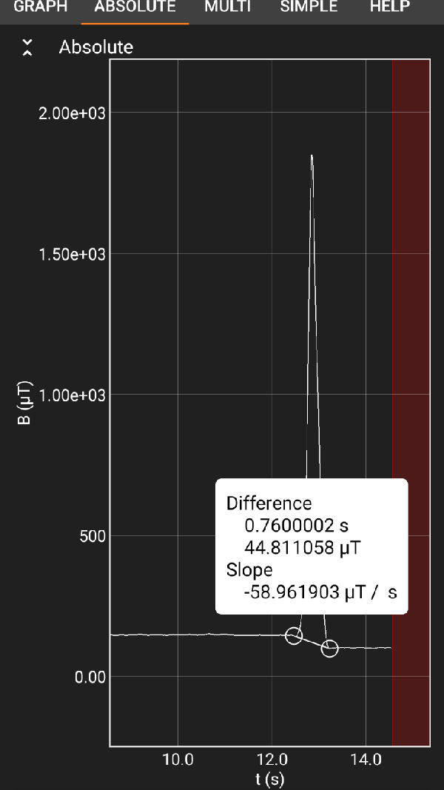
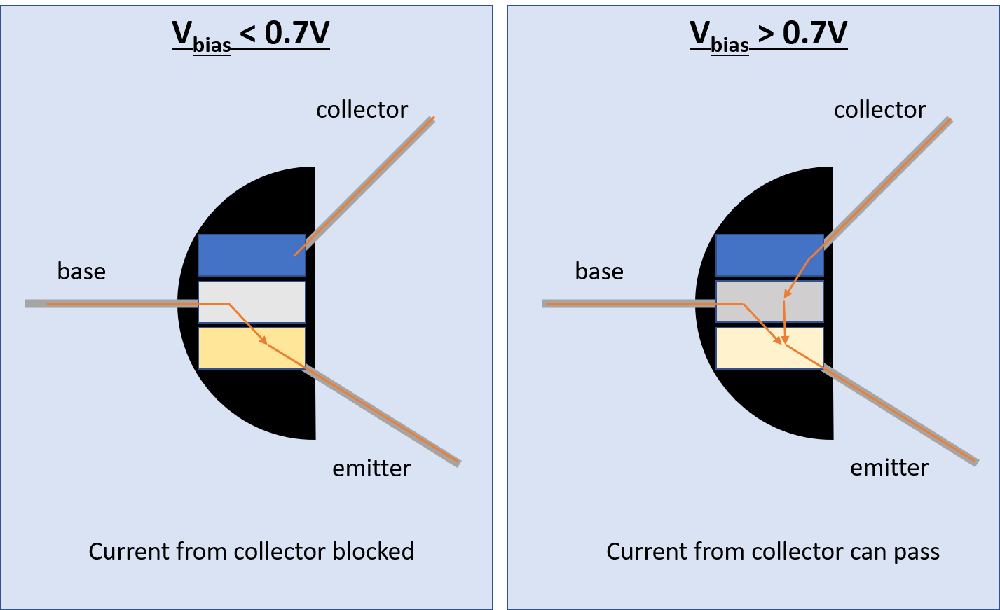

# Lab 3: Faraday's Law

::: Materials
- [c] Wire Leads
- [c] Breadboard 
- [c] Magnet Wire
- [c] Multimeter
- [c] Magnets
- [c] Power Block
- [c] Transistor (kit)
- [c] LED
- [c] 10 $\Omega$ resistor
- [c] 2000 $\Omega$ resistor 
- [c] A multimeter
:::

# Induction and the Electromotive Force

We previously completed two projects focusing on the physics of moving charges -- their behavior in external magnetic fields, and the magnetic fields they themselves generate. We now move on to talk about moving *magnets*.

As you may have learned by now, similarly to the way a moving charge (and, hence, a changing electric field) can generate a magnetic field, a changing magnetic field also induces an electric field. This electric field, like any, has the ability to do *work* [fn] Magnetic fields themselves cannot do work, but when energy is expended (e.g. by pushing a magnet) to cause a change of magnetic field or flux in some region, the resulting electric field can do work.[/fn] . Specifically, we will be interested in how it can do work to generate current in a wire. In this lab, we will investigate the current induced in a loop of wire in the vicinity of a moving magnetic source.

The equation that describes the creation of an electric field by a changing magnetic field is Faraday’s Law. It states that if any open surface experiences a time-varying magnetic *flux*, then a net voltage (or emf) exists around the perimeter of that surface. Here, flux refers to the net magnitude and direction of magnetic field lines penetrating the area enclosed by a loop of wire, or 

::: Equation
$$
\Phi_B= \vec B \cdot \vec A
$$
:::

For a coil with a loop of area $A$, Faraday’s Law predicts that the emf measured around the perimeter is

::: Figure:Equation
$$
V_{coil} =  V_{loop} = - \frac{d \Phi_B}{dt}
$$
:::

Note that the cause of Faraday’s Law is some **time-varying** external magnetic field. 

:::Simulation
<iframe src="https://kapawlak.github.io/PhDemoJS/Apps/Faradays_Law/Faradays_Law.html" width= "100%" height="850px" style="border:none;"></iframe>
:::
In which direction does the current flow in such a situation? The question is addressed by Lenz's law, which states that the magnetic field generated by the current flow (recall the previous lab experiment) will point in the direction *opposite* to the change  in the magnetic flux  from the external field -- the electron motion attempts to generate a $B$ field that "cancels out"; the change in flux, so that the total field in the region is $\vec B =0$.

:::Question
Try to describe what would happen if, instead, the current generated a magnetic field that aligned with the external flux, recalling that a current itself generates a magnetic field. Which laws of physics would might this ultimately break? 
:::

For a coil with $N$ loops in series, the area increases to $NA$, so Faraday’s Law predicts that the emf measured around the perimeter is:

::: Equation
$$
V_{coil} = N V_{loop} = - N\frac{d \Phi_B}{dt}
$$
:::
The effect of these loops is essentially to amplify the emf by a factor of $N$. 

This part of the lab will involve the study of Faraday’s Law and Lenz’s Law acting upon a coil. For Option 1, We will measure Lenz’s Law by moving a magnet suddenly toward or away from the coil, and observing the direction of current. For option 2, we will create a wireless power transmitter by creating a magnetic field that oscillates very quickly, and capturing it with another coil connected to an LED. 

# Faraday's Law Experiments

## Lenz's Law

:::Materials
- [c] Roll of Aluminum Foil
- [c] Magnets (a stack of them works best)
- [c] Ruler
- [c] Phone with Phyphox
:::

:::::::::Exercise
In this exercise, we will observe a fairly dramatic demonstration of Lenz's law using just magnets and a tube of aluminum foil. 

**First Observations**:
1. Hold your roll of aluminum foil vertically.
2. Drop the magnets through the center of the tube and observe what happens

:::Question
1. Did the magnet fall slower or faster than usual?
2. What direction, relative to the magnet's velocity, did the induced current result in a force?
3. Does this agree with Lenz's Law? Explain your reasoning.
:::

**Work and Power:**

In the following steps, we will be trying to measure the time it takes for the magnet to pass through the tube. You are welcome to use any method you wish to do this (i.e. taking a video), but we found this to be the simplest way.
::::::RFigure lenzdemo s
:::col l6

Me, doing the experiment
:::

:::col l6

What my data looks like
:::

::::::

1. Measure the length of your foil roll.
2. Mark the half-way point.
3. Place a cotton ball or a bunched up napkin in the bottom end of your foil roll to prevent damage to the table/magnet, and set your foil roll to stand upright on the table.
4. Open Phyphox in uncalibrated magnetometer mode
5. Hold the magnetometer against the foil roll at the half way mark and start recording.
6. Drop the magnet through the tube. Phyphox will record a spike-like signal from the magnet passing by.
7. Stop recording once the magnet reaches the end.
8. Estimate the time that it took the magnet to fall by finding the width of the peak at the lowest point, as in [Fi](#Fi-lenzdemo)
9. Repeat this five times and record the average of these times.

:::Question magnet-dat
For the following questions, you can assume that the magnet reaches terminal velocity in the tube very quickly. If you do not know the weight of your magnet, please approximate it from the volume multiplied by the density of Neodymium: $7.0$g cm$^{-3}$
1. What is the average time it took for your magnet to pass through the tube?
2. What is the total length of the tube?
3. What is the weight of your magnet? 
4. What is the *total work done* on the magnet by Faraday's Law?
5. What is the power supplied by your magnet falling through your aluminum tube?
:::
:::::::::

:::Question

**NEEDS REVISION UNITS OF b ARE FUNKY**

Faraday's Law causes a drag force that is very similar to that caused by air resistance[fn] This is actually a hard problem, with fairly recent work. Source: [https://arxiv.org/pdf/physics/0406085.pdf](https://arxiv.org/pdf/physics/0406085.pdf)[/fn]. For our magnet in a cylinder at low speeds, this can be written:

$$
\vec F_{tot} = - m g \hat z  - \sigma b v \hat v
$$
where $m$ is the magnet's mass, $g = 9.81$ m s$^{-2}$, $\sigma$ is the electrical conductivity of aluminum, $v$ is the speed of the magnet, and $b$ characterizes the strength of the magnet.
1. Using the above equation, find an expression for the terminal velocity $v_t$ in terms of $m$, $g$, $b$ and $\sigma$. [fn] Hint: What is the total force, $F_{tot}$ on a falling body that has reached terminal velocity? [/fn]
2. Using your **data** from [Qu](#Qu_magnet-dat), calculate the terminal velocity of your magnet. You may assume that the terminal velocity is reached instantaneously.
3. The electrical conductivity of aluminum is $3.8 \times 10^7$ S m$^{-1}$ (siemens per meter). Using your equation for terminal velocity and the rest of your data, calculate $b$.
:::

## Wireless Power Transmission

:::Materials
- [c] Wire Leads
- [c] Breadboard 
- [c] Power Block
- [c] Transistor (kit)
- [c] LED
- [c] 10 $\Omega$ resistor
- [c] 1000 $\Omega$ resistor 
:::

:::RFigure osc m

:::

In this experiment, we will use a transistor to create a high-frequency oscillating magnetic field that uses Faraday's Law to transmit power. While the behavior of transistors is a topic beyond the scope of this class, we will briefly present a cartoon of their function so you can understand how they are generating an oscillating field.

Transistors have three leads: The collector which "collects" current, the emitter which "emits" current, and the base which determines when current in the collector can flow to the emitter.

In general, transistors can be used in a variety of modes. In this lab, we will use them in the *charge collector* mode, which allows them to operate like a switch. In charge collector mode, current is blocked between the collector and emitter terminals *unless* there is a sufficient voltage between the base and the emitter, often called a *bias* voltage. We can use this by creating a situation that causes voltage on the base terminal to rise and fall very quickly, leading to the collector-emitter current being turned on and off at a high frequency.

:::Figure trans xl

:::

When the current from the emitter runs through a coil, the result is that a pulsed magnetic field is created from the very fast switching on and off of the current. If we connect the base terminal to a secondary coil in the same orientation, the result is a magnetic field that oscillates between the maxima.

::::::Exercise

**Construction of the Transmitter Coil:**

:::RFigure tcoil m

:::

1. Leaving a 5-10 cm of tail, wrap the wire 15 times around something round.
2. Skip a 10- to 15-cm section of wire, and resume winding the wire in the same direction for another 15 turns. For the final loop, you can wrap the wire around itself to keep the loop stable.
3. Cut the wire to leave another 5-10 cm of tail.
4. The skipped wire from step 2 should create another &ldquo;tail&rdquo; in the center of your coil. Twist this section to secure it, and use scissors to cut it, leaving four wire ends in total as in [Fi](#Fi-tcoil).

####

**Construction of the Receiver Coil:**

:::RFigure coil2 xs

:::

1. Coil the wire around something round 15 times, leaving 5-10 cm of tail on each side. 
2. To keep the coil in place, you can wrap the final loop of wire around itself
3. Twist the enamel-free ends of the coil with the leads of an LED.

:::Figure transmitter xl

After wrapping your first 15 loops, create the central lead in the coil by pulling some extra wire down and twisting before wrapping the last 15 loops.
:::

With the two DIY components built, we are now ready to assemble the circuit.

####

**Construction of the Circuit:**

1. Insert your transistor into the board so that each of the three leads is in a different row. 
2. With the flat edge of your transistor facing the right side, connect the bottom lead to ground through a 10-$\Omega$ resistor.
3. The middle lead of the resistor should be connected to one of the **outer** wire ends of your transmitter coil through a-1k $\Omega$ resistor.
4. The remaining **outer** wire end should be connected to the final lead of the transistor.
5. The two center wire ends created by cutting the tail should be plugged into the 3.3-V positive rail. 

:::Figure oscpic l

The full transmitter circuit
:::

**Testing the Transmission:**
1. Turn on your circuit by pressing the button on your power block. 
2. Bring your receiver coil with the LED attached to the transmitter coil. 

:::Figure light m

:::

:::Question
1. Try lighting the LED by holding the receiver coil up to the transmitter coil in both directions. What do you observe? 

2. LEDs have a definite polarity, and light up only if the current is flowing into the positive terminal and out of the negative terminal. Why does this agree with your observations above?

3. The transistor causes a roughly sinusoidal magnetic field oscillation at a frequency of about $\omega \approx 6$ MHz, or a peak-to-peak time of \~ 166 ns. The magnetic field at any point around the transmitter loop can then be written
    $$
    \vec B(\vec r, t) = \vec B_{max}(r) \sin(\omega t)
    $$
If it takes 1.5 V to turn on your LED, estimate the **minimum** value of the maximum magnetic flux through your receiver, $\Phi_{max}$, induced during the oscillation. 

:::
::::::

# Write Up

###  **@fa-hand-o-right@  Instructions :**
 #### **1. Answer all questions clearly, showing your work where appropriate.**
 #### **2. Starting on a seperate page:** 
  - Write a short summary (~0.5 page, single spaced) describing Faradays Law, how you tested it, and any important observations.
  - Write a short summary (~0.5 page, single spaced) describing how you can infer the speed of light using the wavelength, how you tested it, and any important observations. 
  - In these summaries, be sure to **summarize your results** and **reasons why you believe your data are precise and accurate**. If you do not think your data are accurate, explain why, and how this could be fixed in a future lab.

 #### **3. Additional Information:**
 - You should attach images of your plots,  data, and setup.  Doing so may allow you to regain partial or full credit even if your experiment fails.

::::::Summary
  :::Hider Lab Submission
  <iframe id="contentframe" width="100%" src="https://gauchospace.ucsb.edu/courses/mod/lti/launch.php?id=6625130&triggerview=0" allow="microphone https://coursekit.google.com; camera https://coursekit.google.com; geolocation https://coursekit.google.com; midi https://coursekit.google.com; encrypted-media https://coursekit.google.com;" allowfullscreen="1" style="height: 500px;"></iframe>
 :::
::::::

# Feedback

Any feedback you choose to give will be used to improve labs this quarter! Feedback is not required on all questions. If you'd like just to leave some comments, scroll to the bottom of the form.
::: Hider Open Feedback Form
<iframe src="https://docs.google.com/forms/d/e/1FAIpQLScofu1hER8iG59Pe75ptNfl0BjwjcZgOPoE26rq2OFlyAhCIg/viewform?embedded=true" width="100%" height="1000" frameborder="0" marginheight="0" marginwidth="0">Loading…</iframe>
:::

