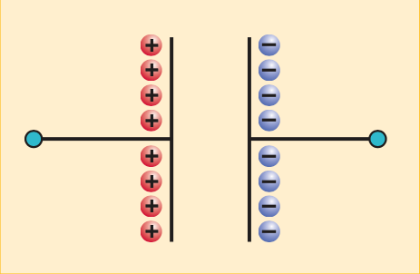
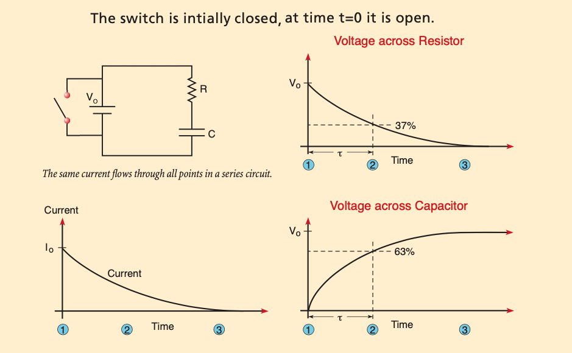
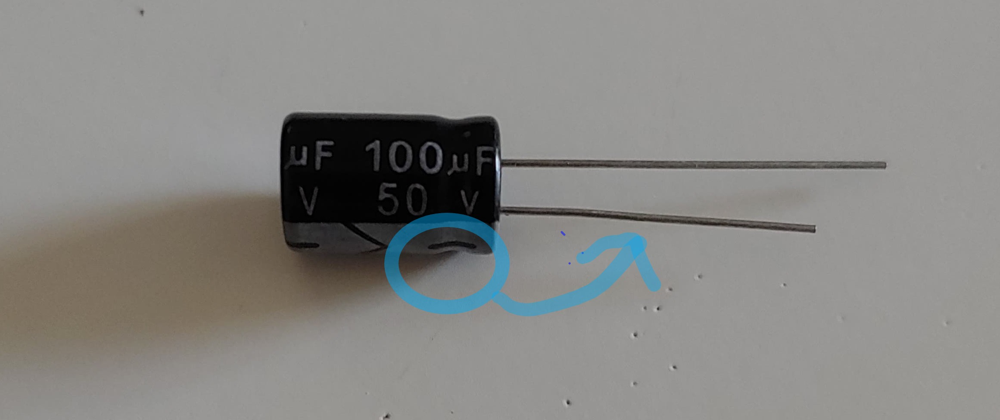
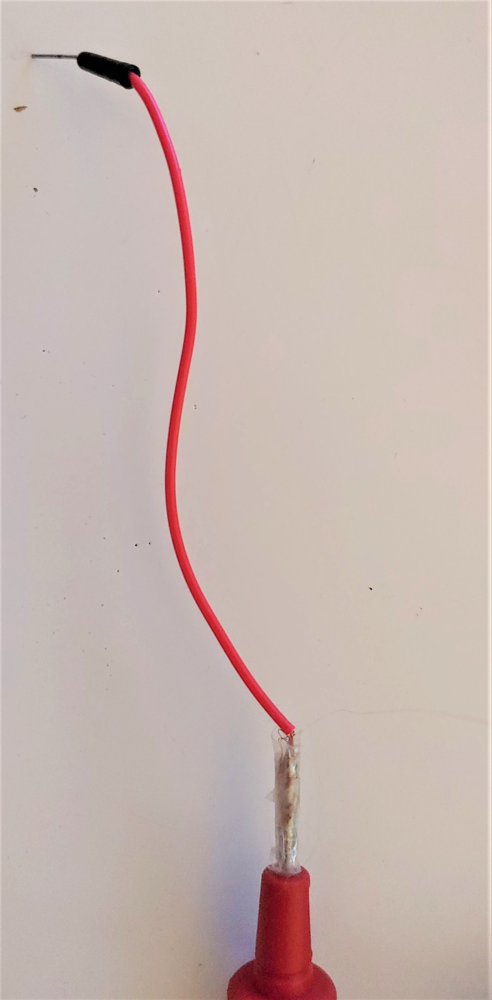
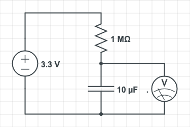
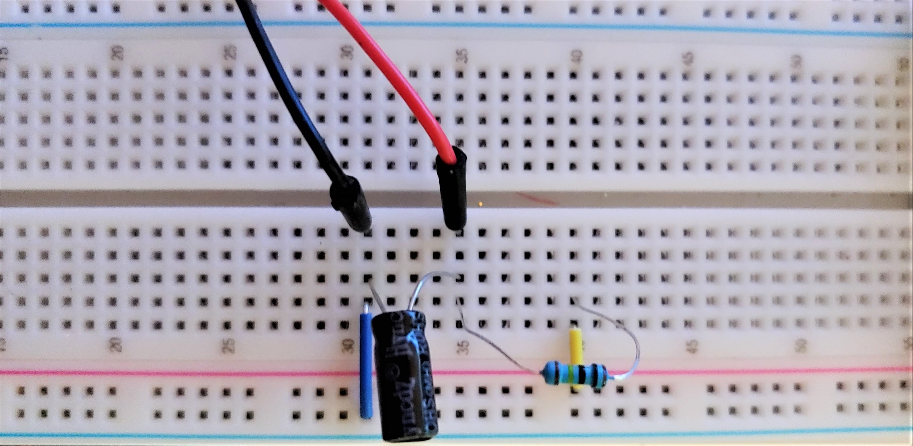
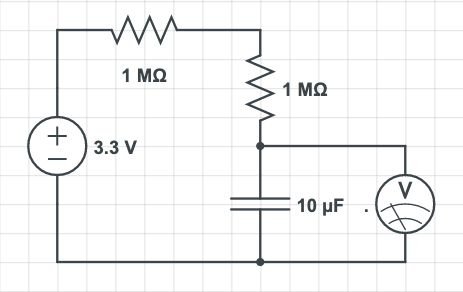
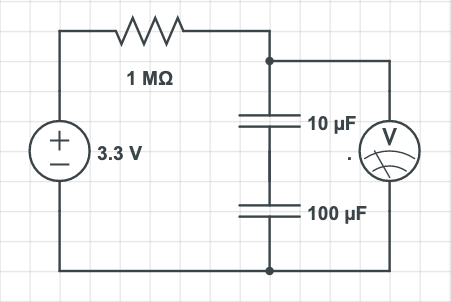
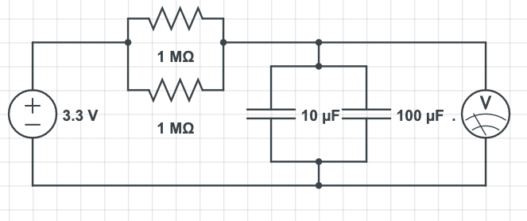

# Lab 4: RC Circuit

::: Materials
- [c] Wire Leads 
- [c] Breadboard 
- [c] Two 1-MΩ resistors 
- [c] One 100-μF capacitor
- [c] One 10-μF capacitor
- [c] A multimeter
- [c] Something to keep time
:::

# Circuit Elements and their Interactions
We now move on to explore moving charges, *i.e.*, currents,  that are confined to wires. As you likely know, if there is a potential difference across a conducting wire, electrons (negatively charged) will move from low potential to high potential. The movement of electrons forms current. Current is defined as the rate at which charges move:

::: Equation currentcharge
$$
I =  \frac{dQ}{dt}
$$
:::

In this part of the lab, we will review the concepts and mathematical descriptions of the resistors and capacitors in an RC circuit. We will discuss how each element behaves in a circuit, and formulate an equation to model their behavior when connected together. We will also discuss the meaning of an equivalent circuit. 

## Resistors and Ohm’s Law

Resistors -- as implied by their name -- resist charge flow. They convert some of the kinetic energy of electrons into *heat*. While all materials [fn]except those that obtain a *superconducting* state at very low temperatures[/fn] have resistance, resistors are specially constructed circuit components with known resistance values that are much higher than those of most metals, and have *Ohmic* behavior. 

Ohmic  behavior means that the current, resistance, and potential difference across a resistor are related by Ohm’s Law:

::: Equation ohm
$$
I =  \frac{V_R}{R}
$$
:::

where $V_R$ is the voltage across the resistor in Volts (V), $R$ is the resistance of the resistor in Ohms (Ω), and $I$ is the current in the resistor in Amperes (A).

## Capacitors

::: RFigure platecap m

:::

A capacitor is a device that stores energy by separating opposite charges across a very thin layer of insulating material, causing a large potential difference between the charged areas. You have likely learned about parallel plate capacitors, like that in [Fi](#Fi-platecap). While this is a very simplistic model of how most capacitors work, the basic functionality is the same: by connecting a capacitor to a battery source, a capacitor collects opposite charges and stores the energy as an electrostatic field in the region between them.

In the case of a parallel plate capacitor, the voltage across a capacitor is directly related to the amount of charge on the plates. A larger amount of charge results in a larger potential difference across the capacitor. The relation between the voltage across, and the amount of charges on, the capacitor is given by

::: Equation
$$
V_C =  \frac{Q}{C}
$$
:::

where $Q$ is the charge in Coulombs (C), $C$ is the capacitance in Farads (F), and $V_C$ is the voltage across the capacitor in Volts (V).

## Adding Elements to a Circuit
### Capacitor Dynamics
First, let&rsquo;s understand how capacitors in a circuit behave. Using the definition of current in [Eq](#Eq-currentcharge), we have

::: Equation cap1
$$
I =  \frac{d(CV_C)}{dt} = C \frac{dV_C}{dt}
$$
:::

which relates the current into a capacitor to the rate of change of the voltage. Note that it takes some time to build up charges. So the voltage across a capacitor cannot instantaneously increase. 

It may be more helpful to rearrange this equation in the following way:

::: Equation cap2
$$
\frac{dV_C (t)}{dt} = \frac{I(t)}{C}
$$
:::

Here we see that the *change in the voltage across the capacitor* at any time is equal to the current divided by the capacitance. This doesn&rsquo;t mean that a capacitor can charge forever; recall that *the current itself* is generated by a potential difference across a wire. As the capacitor acquires charge, the potential difference between the capacitor and source monotonically decreases until *no current flows*, *i.e.*, $\frac{dV_C}{dt} = \frac{0}{C}=0$.

If we remove the power source (*e.g.*, turn off the power block), then the potential difference between the capacitor and ground reverses, so that charges flow *out of the capacitor* following the same equation[fn].Note that since the direction of the potential difference changes, $I(t)$ picks up a negative sign![/fn].

### The Basic RC Circuit

In a circuit with a highly conductive wire, these processes happen very quickly since charges are free to accelerate along the potential line with minimal resistance. In order to see this phenomenon on human timescales, we must add a resistor to our circuit.

::: Figure rc

:::

Consider the circuit given in [Fi](#Fi-rc). Before the circuit is powered on, both the capacitor and resistor initially have 0 V across them. We know that the instant the the circuit is powered on, the resistor has a voltage of $V_0$, so by Ohm&rsquo;s law, the current is $I = V_0/R$. The capacitor, on the other hand, is only beginning to charge according to $\frac{dV}{dt} = \frac{I(t)}{C}$. 

As charge flows through our resistor, the potential difference moves to the capacitive element. Since the total potential difference of the circuit measured across the battery is $V_0$, we know that:

:::Equation constraint
$$
V_C +V_R = V_0
$$
::: 

We start by using [Eq](#Eq-ohm) to substitute for $I(t)$ in [Eq](#Eq-cap1). We find that the voltages across the capacitor and resistor, at any time, are related by
:::Equation vcvr
$$
 C \frac{dV_C (t)}{dt} = \frac{V_R(t)}{R} 
$$
:::

We can now apply the constraint given in [Eq](#Eq-constraint) to eliminate $V_C(t)$ from the equation. Substituting $V_C(t) = V_0 - V_R(t)$, and noting that $V_0$ is a constant, and therefore its derivative is 0, we get:

$$
\begin{aligned}
C \frac{dV_C (t)}{dt} &= C \frac{d(V_0 - V_R(t))}{dt} \\\\
&= - C \frac{d V_R(t)}{dt}
\end{aligned}
$$

giving us a differential equation in $V_R(t)$ only:

:::Equation vrvr
$$
 C \frac{dV_R (t)}{dt} = - \frac{V_R(t)}{R} 
$$
:::

This is a first order differential equation that may be integrated. First, move all of the $V_R$ terms to one side, and $dt$ to the other. 

$$
 \frac{dV_R}{V_R} = -\int_0^{t} \frac{1}{RC} dt
$$

Next, integrate from $(0,t)$, $V_R(t=0) = V_0$ to $V_R(t)$

$$
 \int_{V_0}^{V_R(t)}\frac{dV_R}{V_R} = -\int_0^{t} \frac{dt}{RC}
$$

The left-hand side of this equation is a common integral, which we leave as an exercise. The right-hand side contains only constants in the integrand. The result is therefore:
$$
 \ln (V_R(t)/V_0) = -\frac{t}{RC}
$$

Exponentiating both sides gives us our final result for the voltage across the resistor over time:

:::Equation rcfinal
$$
V_R(t) =  V_0 e^{-\frac{t}{\tau} }
$$ 
:::
Finally, plugging this into the constraint $V_0 = V_R +V_C$, we get the voltage across the capacitor:

:::Equation cfinal
$$
V_C(t) = V_0 (1-e^{-\frac{t}{\tau} } )
$$
:::

We have defined the **time constant**, $\tau \equiv RC$, in these two equations. This time constant is determined by the resistance and capacitance of the elements in your circuit.

### Measuring the Time Constant

As we near the end of our theoretical discussion, we will now describe how to actually measure the constant with the equipment you have available. A nice feature of [Eq](#Eq-rcfinal) is that the voltages across the respective elements take *special values* when $t=\tau$:

:::Equation rcfinal-approx
$$
\begin{aligned}
V_R(\tau) &=  V_0 e^{-\frac{\tau}{\tau} }\\\\
   &=  V_0 \frac{1}{e}\\\\
   &\approx 0.37  V_0
\end{aligned}
$$ 
:::
and, similarly 
:::Equation rcfinal-approx
$$
\begin{aligned}
V_C(\tau) &=  V_0 (1- e^{-\frac{\tau}{\tau} })\\\\
   &=  V_0 (1- \frac{1}{e})\\\\
   &\approx 0.63  V_0
\end{aligned}
$$
:::

This means that during the **charging cycle**, the time at which the voltage across your resistor or capacitor reaches $37$% and $63$% of the maximum, respectively, is a measure of $\tau$. 

For technical reasons related to the multimeter, we will be measuring the voltage across the capacitor in this experiment. Since the capacitor takes a long time to charge, we will be interested in studying the **discharging cycle**. This is easier to work with since you know the voltage across the capacitor the moment you turn off the power, and you don&rsquo;t have to guess at what the maximum voltage is! You will work out the equation you need in [Qu](#Qu-check).

## Equivalent Circuits

Recall that for resistors in series, the equivalent resistance is given by

::: Equation Rseries
$$
R_{eq} =  R_{1}+R_{2}+R_{3}
$$
:::
And for resistors in parallel, the equivalent resistance is given by

::: Equation Rparallel
$$
\frac{1}{R_{eq}} =  \frac{1}{R_{1}}+ \frac{1}{R_{2}}+ \frac{1}{R_{3}}
$$
:::

In addition to calculating the time constant for different circuits, we will be wiring the capacitors in both series and parallel configurations. The equation for the equivalent capacitance for capacitors in series is

::: Equation Cseries
$$
\frac{1}{C_{eq}} =  \frac{1}{C_1}+ \frac{1}{C_2}
$$
:::

The equation for the equivalent capacitance for capacitors in parallel is

::: Equation Cparallel
$$
C_{eq} =  C_1+C_2
$$
:::

::: Question check1

Check your understanding of the theory material by answering the following questions:
1. A 5-kΩ resistor is placed in series with two 10-kΩ resistors in parallel. The entire circuit is connected to a power supply of 20 V. What is the voltage across each element?
2. A 0.1-μF capacitor has 16 V across its terminals. How much charge does it hold?
3. What is the current flowing into a 0.01-μF capacitor if the voltage across its terminals changes at a constant rate of 2 mV per second?
:::

:::Question check
The equations given describe the behavior of a *charging* capacitor. In the following experiments, we will want to work with a discharging circuit since we will know the initial voltage across a charged capacitor.

Imagine that you&rsquo;ve charged your capacitor to some voltage $V_{max}$ and then turned off the power source.
1. After the power source has been switched off, what is the constraint on the voltages of the resistor and capacitor?
2. Combining  [Eq](#Eq-cap1) and [Eq](#Eq-ohm) as before, we get [Eq](#Eq-constraint)
$$
C\frac{d V_C(t)}{dt} = \frac{V_R(t)}{R}
$$

Using the constraint from part (a), substitute the right-hand side of this equation so that the entire expression is only in terms of $V_C(t)$

3. Integrate both sides of this expression to find the equation for $V_C(t)$

4. What is the value of $V_C(t)$ when $t = \tau$?
:::
# Experiments
In this lab we will measure the time constant, $\tau$, of four different circuit configurations. The procedure for each of these labs is fairly quick and virtually identical. After the initial identification of your circuit components and the set-up of your first circuit, you will only have to switch out elements and record new data for each exercise.

## Pre-lab Set-up

Even though the resistors and capacitors are labeled in the electronics kit, it&rsquo;s useful to learn how the resistance is color coded. It is recommended to double check the 5-band code to make sure the resistors you are using are correct for the lab, especially if you have removed them from their packaging already.

::::::Hider Identifying Resistors
Learning to read the code to identify resistors is a crucial skill in real laboratory work. Resistors are the small capsule-shaped elements with wires at either end. You should notice that each resistor has a set of four colored bands around its body. The order and color of these bands indicate the element&rsquo;s resistance and *tolerance* -- *i.e.*, its margin of error as a percent of the nominal value.

In a 5-band resistor, the first four bands tell you the value of $R$, and the $5^{\rm th}$ band gives you the tolerance. To read your resistor, first you need to determine the correct reading direction. There should be a larger gap between the $4^{\rm th}$ and $5^{\rm th}$ (tolerance) bands, than there is between any other two bands.

There are two ways you can use the colors to assign values -- either by using the lookup table below or by using an [online calculator](https://www.digikey.com/en/resources/conversion-calculators/conversion-calculator-resistor-color-code).

:::Figure

:::

Prior to starting the experiments, you should find the resistors for this lab and double-check their resistance. For students with the RexQualis kit, in total, you should have 10-20 of the following:

- @fa-chevron-right@ 10/100/220/330 Ω Resistors
- @fa-chevron-right@ 1/2/5.1/10/100 kΩ Resistors
- @fa-chevron-right@ 1 MΩ Resistors

::::::

:::Hider Identifying Capacitors

The capacitors, which are black cylindrical elements with wires coming from the bottom, are much easier to identify: simply read off the values printed on the side. You should find 10 of the following:

- @fa-chevron-right@ 10/100 μF Electrolytic Capacitors
- @fa-chevron-right@ 22 pF/ 100 nF Ceramic Capacitors

Electrolytic capacitors are very different from their ceramic counterparts[fn]For detailed information please see [wikipedia](https://en.wikipedia.org/wiki/Electrolytic_capacitor)[/fn]. Rather than being made of either ceramic or plastic, the dielectric in an electrolytic capacitor consists of an oxide coating on its plates. This oxide coating is formed by the application of a voltage across the capacitor at the end of the manufacturing process. Because of this, electrolytic capacitors are **polarized**, meaning that they have designated positive and negative leads. Applying a potential across them in the wrong direction would result in reduction of the oxide dielectric to form the neutral metal and liberate oxygen. Eventually, this would create shorts between the plates of the capacitor, and increased pressure inside it, leading to explosive failure.
:::Warning
 When using electrolytic capacitors **please make sure that you respect the orientation** by checking for the + and - symbols on the shell. Inserting them with the wrong orientation can *destroy* the electrolyte, ruining the capacitor. Please make sure the "-" end is connected to the negative rail of your power.
  

 
:::

The capacitors suppled by the RexQualis kit are manufactured by Hyncdz. You may assume that these capacitors have a 20% tolerance. If you are using a capacitor from a different manufacturer, especially if it is a different kind of capacitor, please look up the data sheet for the component.

::::::Question
In the following exercises, we will need:
- 1-MΩ resistors 
- 10 μF capacitors
- 100 μF capacitors 

Using the tolerance, write down the values of these components with their *uncertainty* in the form:
- ($1 \pm \delta_R$) MΩ
- ($10 \pm \delta_C$) μF
- ($100 \pm \delta_C$) μF

Here $\delta$ should be an *absolute* uncertainty, not a percent. For example, if your tolerance was 1% on your 1-MΩ resistor, you would record the value as  ($1 \pm 0.01$) MΩ. For both capacitors, use the tolerance of 20% to calculate the uncertainty. 
:::Note
This interval that you calculated is the error associated with the component due to the manufacturing process. This means that your resistors and capacitors will never be exactly what they are labeled -- they will usually be within the interval. We will need to take these deviations into account when comparing our measurements to theory. 
:::
::::::

Now let’s set up four RC circuits. For each setup, you will measure the time constant and compare it to the theoretical value.

:::::::::Note

It is recommended that you modify your multimeter leads to free up your hands. You can do this by cutting your solderless jumper wires, removing the insulation, wrapping the strands around the tip of a lead, and taping to secure. This lets you plug your multimeter directly into the breadboard.

:::::::::

## 1. A 10-μF capacitor and a 1-MΩ resistor in series

::: Materials
- [c] Wire Leads and breadboard
- [c] One 1-MΩ resistor
- [c] One 10-μF capacitor
- [c] A multimeter
- [c] Something to keep time
:::

For the first exercise, we are going to place a 10-μF capacitor in series with a 1-MΩ resistor. In addition, we need to place a voltmeter across the capacitor in order to visualize both charge-up and discharge situations. In this lab, the multimeter is our voltmeter.

::: Figure

:::

Before starting the experiment, we will make some basic theoretical calculations for this circuit to calibrate our expectations. In addition to predicting the time constant we will observe, we will use the tolerances of our components to find our error interval. 
:::::: Question theorytau
1. Use the values of the resistor and capacitor to calculate the theoretical value of the time constant for this RC circuit. 
2. Using the uncertainty bounds of the resistor and capacitor, calculate the error bound $\delta_\tau$  of this measurement. 

Hint: To calculate the total uncertainty of a product of two independent variables, use the following formula:

For a product
$$
\tau = RC
$$

where the uncertainties of $R$ and $C$ are uncorrelated, the error bound, $\delta\tau$, of $\tau$ may be calculated as:
:::Equation producterror
$$
\frac{\delta\tau}{\tau} = \sqrt{\Big|\frac{\delta R}{R}\Big|^2 + \Big|\frac{\delta C}{C}\Big|^2}
$$
:::

You are not required to know how to derive this, but interested students can learn more about this formula in Taylor&rsquo;s excellent [Error Analysis Textbook](http://hep.ucsb.edu/courses/ph128_18f/Taylor.pdf)[fn]The formula is derived in section 2.9[/fn].

3. Write your final result as $(\tau \pm \delta_\tau)$. The bounds you have calculated on $\tau$ are your expected error bounds. Based on the tolerances of your components, you would expect that even if an experiment were executed perfectly, your final result would typically end up somewhere in this interval because of the corresponding **uncertainty** in your components&rsquo; actual values.
::::::

:::::: Exercise ex1

We will be using our wires, elements, multimeter and breadboard to create the circuit. The instructions here look long only because there is no elegant way to explain circuit construction in words. Feel free to check with the above circuit diagram while following the instructions. After you have set everything up, the wiring should make sense.

Set-up:
1. Set up the power supply and voltmeter.
2. Insert the resistor and capacitor into the breadboard. Note that rows (horizontal) within a given column are connected to each other, so the resistor should end in the same row in which the capacitor starts, to ensure that they are connected together.
3. Connect the voltmeter across the capacitor.

This diagram shows how to connect elements in series and/or parallel. Note that all spots on the same row on breadboard are connected.

:::Figure

:::

Once you have wired the circuit, you are ready to collect data. We will first collect data on the *discharging* cycle:

5. Turn on your circuit and fully charge your capacitor. You will know that the capacitor is fully charged when the reading on your multimeter stops changing.
6. Once the reading stops changing, record the value you observe.
7. Turn off your power block and start your timer.
8. Record the time it takes for your capacitor to discharge to 37% of its maximum.

After recording these values, we will now measure the time constant for the *charging* cycle. 

9. Fully discharge your capacitor by momentarily connecting a wire across it.
10. Reset your timer.
11. Turn on your power block on and start your timer.
12. Record the time it takes to charge to 63% of the maximum value recorded previously. 

::: Question
What are the values you calculated from the charge and discharge curves? Are they close? Is it sufficient to measure $\tau$ from only one of the curves? Explain your reasoning.
:::

::: Question
1. What is the average experimental value of $\tau$ that you measured? Call this $\tau_{measured}$

2. Calculate the discrepancy with the theoretical value that you calculated in [Qu](#Qu-theorytau). The discrepancy is defined by the quantity 
$$
\text{discrepancy} = |\tau_{theoretical} - \tau_{measured} |
$$

3. Is the discrepancy smaller than your error bounds? If not, propose some reasons for this: describe possible sources of systematic error, *e.g.*, external factors like humidity or poor contact, that might lead to shorter or longer discharge times, dying batteries, inaccurate timing.

:::

:::Note
If your values don't seem correct, that doesn't necessarily mean that you've done something wrong! *Some* multimeters have a relatively low **internal resistance** (also called impedance), on the order of  $1-5$ M$\Omega$. In this case, your circuit will effectively have an additional resistor *in parallel* with the capacitor. If you believe that this may be affecting your results, in part c of the questions, argue that after considering this possibility, your results make sense. If you have your device's data sheet, please include the actual impedance value. 
:::
::::::

## 2. A 10-μF capacitor and two 1-MΩ resistors in series

::: Materials
- [c] Wire Leads and breadboard
- [c] Two 1-MΩ resistor
- [c] One 10-μF capacitor
- [c] A multimeter
- [c] Something to keep time
:::

:::Figure 

:::

:::::: Exercise
Repeat the **discharging cycle** described in [Ex](#Ex-ex1) with two 1-MΩ resistors connected in series. This is now a new circuit with a new time constant.

::: Question
1. Calculate the equivalent resistance of this circuit and its error, $(R_{eq}\pm \delta R_{eq})$

Hint: The error of a sum of independent variables
 $$
    X_{eq} = X_1 + X_2
 $$
  has the formula

$$
\delta{X_{eq}} = \sqrt{(\delta{X_1})^2 + (\delta{X_2})^2}
$$

2. Calculate the theoretical value of the time constant and its error, $(\tau \pm \delta\tau)$ for this RC circuit. 
3. Calculate your discrepancy and compare it to your error bounds, discussing possible sources of systematic error.
:::

::::::

## 3. A 10-μF capacitor, a 100-μF capacitor, and a 1-MΩ resistor in series
::: Materials
- [c] Wire Leads and breadboard
- [c] One 1-MΩ resistor
- [c] One 10-μF capacitor
- [c] One 100-μF capacitor
- [c] A multimeter
:::

:::Figure

:::

:::::: Exercise
Repeat the **discharging cycle** in [Ex](#Ex-ex1) by adding a 100-μF capacitor in series in the circuit. You need to make sure that the voltmeter will be measuring the voltage across **both** capacitors.

::: Question
1. Calculate the equivalent capacitance of this circuit and its error, $(C_{eq}\pm \delta C_{eq})$

Hint: The error for a variable 
$$
X_{eq} = \Big( \frac{1}{X_1} + \frac{1}{X_2}\Big)^{-1}
$$
Is given by:
$$
\Big(\frac{\delta{X_{eq}}}{X_{eq}^2}\Big)^2 = \Big(\frac{\delta{X_{1}}}{X_{1}^2}\Big)^2+\Big(\frac{\delta{X_{2}}}{X_{2}^2}\Big)^2
$$

2. Calculate the theoretical value of the time constant and its error, $(\tau \pm \delta\tau)$ for this RC circuit. 
3. Calculate your discrepancy and compare it to your error bounds, discussing possible sources of systematic error.
:::
::::::

## 4. A 10-μF capacitor and a 100-μF capacitor in parallel, in series with two parallel 1-MΩ resistors
::: Materials
- [c] Wire Leads and breadboard
- [c] Two 1-MΩ resistor
- [c] One 10-μF capacitor
- [c] One 100-μF capacitor
- [c] A multimeter
:::

::: Figure

:::
:::::: Exercise
Repeat the **discharging cycle** in [Ex](#Ex-ex1) by connecting two capacitors in parallel, and two resistors in parallel, and the two components in series in the circuit. Make sure the voltmeter  is measuring the voltage across **both** capacitors.

::: Question
1. Calculate $(R_{eq} \pm \delta R)$ and $(C_{eq} \pm \delta C)$ for this circuit
2.  Calculate the theoretical value of the time constant and its error, $(\tau \pm \delta\tau)$ for this RC circuit.
3. Calculate your discrepancy and compare it to your error bounds, discussing possible sources of systematic error.
:::
::::::

# Write-up

###  **@fa-hand-o-right@  Instructions :**
 #### **1. Answer all questions clearly, showing your work where appropriate.**
 #### **2. Starting on a separate page:** 
  - Write a short summary (~1 page, single spaced) describing RC circuits, how you measured the time constant, and any important observations. 
  - In this summary, be sure to **summarize your results** and **reasons why you believe your data are precise and accurate**. If you do not think your data are accurate, explain why, and how this could be fixed in a future lab.

 #### **3. Additional Information:**
 - You should attach images of your plots,  data, and setup -- doing so may allow you to regain partial or full credit even if your experiment fails.
 
 ::::::Summary
 :::Hider Lab Submission
  <iframe id="contentframe" width="100%" src="https://gauchospace.ucsb.edu/courses/mod/lti/launch.php?id=6625151&triggerview=0" allow="microphone https://coursekit.google.com; camera https://coursekit.google.com; geolocation https://coursekit.google.com; midi https://coursekit.google.com; encrypted-media https://coursekit.google.com;" allowfullscreen="1" style="height: 500px;"></iframe>
 :::
 ::::::

# Feedback

Any feedback you choose to give will be used to improve labs this quarter! Feedback is not required on all questions. If you&rsquo;d like just to leave some comments, scroll to the bottom of the form.
::: Hider Open Feedback Form
<iframe src="https://docs.google.com/forms/d/e/1FAIpQLScjHJlWB-dhhLyjKVbhL2lij6lylZ9-rGcFOIZaffT9hesv5w/viewform?embedded=true" width="100%" height="1000" frameborder="0" marginheight="0" marginwidth="0">Loading…</iframe>
:::

 
 
 
 
