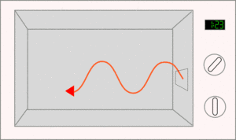
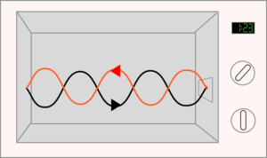
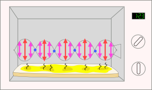
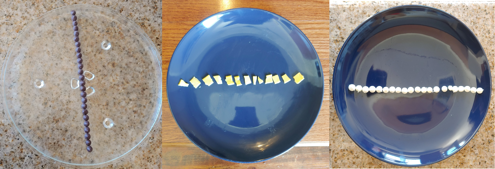
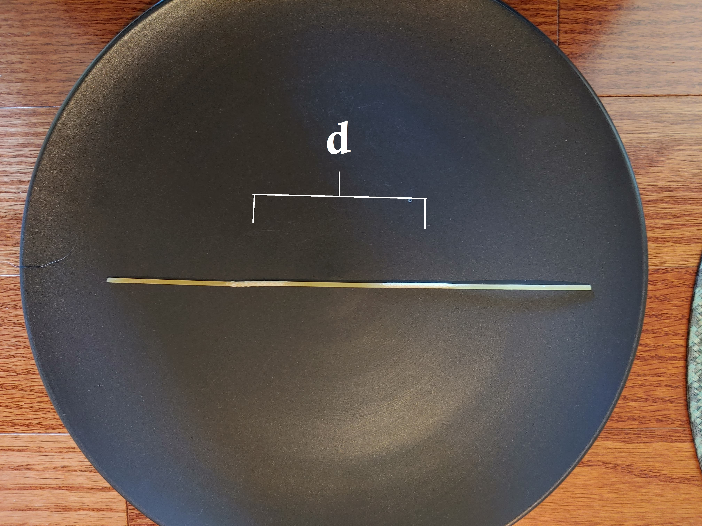

# Lab 5: Speed of Light

::: Materials
- [c] Microwave
- [c] Pasta, Chocolate, or Melting Cheese 
- [c] Ruler
- [c] Microwave-safe plate
:::

# Light 
In this lab, we will use the wave nature of light to measure the speed of light indirectly. Microwave ovens use microwaves, which -- you guessed it -- are simply ordinary light with a relatively large wavelength (compared to "visible" light, that is). Most microwaves operate in the 2.45 GHz frequency band, as this band is the most efficient at exciting rotations of water molecules in food.

Since we know the frequency, $\nu = 2.45$ GHz, if we are able to determine the *wavelength*, $\lambda$, of the signal, we can find the speed of light by using the fundamental relationship:

::: Equation
$$
c =  \nu \lambda 
$$
:::

When a microwave is powered, it produces standing waves across the cooking chamber. We can use the resulting pattern to measure the wavelength of the light by placing a medium in the microwave, with the rotating platform removed, and noticing how it heats up unevenly.

The question we have to ask now is: How can we infer the wavelength of the microwaves by using household objects? The answer is quite simple, actually! Since the microwaves deposit *energy* into water molecules, and that energy depends on the amplitude of the wave at that point, we can look for the first signs of "cooking" in the medium -- places where the wave amplitude is highest will heat faster than the surrounding region. Hence, the cooked regions represent the *antinodes* of the microwaves, and raw regions are near *nodes*. 

:::::::::Figure micro
### How Microwaves Work
::::::col l4

A microwave oven works by producing microwaves in a device called a magnetron, that leave from a hole adjacent to it (typically on the the right). The microwaves will reflect back and forth from the two sides of the metal oven.
::::::
::::::col l4

 The wavelength of the microwaves is tuned to produce a standing wave. This is where you get two waves, one going in each direction, which interact to make some areas where there is a huge vibration and others where there is none.
::::::
::::::col l4

This means that there are places where the microwaves are very intense, where the molecules will be vibrated very powerfully, and so heated strongly, and others where the microwaves are weak.  These areas are separated by half a wavelength.
::::::
:::row
Because of the standing waves, modern microwave ovens contain turntables. Otherwise parts of your food would be overcooked and others would still be raw.
:::
:::::::::

Since we are finding distance between the locations of the antinodes, $d$, our measured distances will represent *half* of our wavelength, $\lambda$.

::: Question
Why is the distance between the food medium and the magnetron not important to the determination of $c$ in this experiment?
:::

::: Question
 Write the equation to calculate $c$ in terms of $d$ rather than $\lambda$.
:::

# Measuring the Speed of Light
::: Materials
- [c] Microwave
- [c] Pasta, Chocolate, or Melting Cheese 
- [c] Ruler
- [c] Microwave-safe plate
:::

:::::: Exercise

:::Figure tested xl

 We tested a number of possible food items to use, and found that using dry pasta that was briefly put under running water to moisten it worked best.
:::
1. Remove the rotating table from your microwave. You may need to place a microwave-safe cup or bowl upside down over the turning gear.
2. Place your medium on the microwave-safe plate.
3. Set the plate in the microwave and turn it on for 10- to 30-second intervals, until you see at least two spots that are melting/cooked
4. Measure the distance between the centers of these two spots.

:::Figure pasta xl

Do your best to measure from the center of the cooked region. Be sure to estimate your measurement error, so that you will be able to determine the precision of your result!
:::

:::Question
1. What is the distance between the centers of your cooked regions, $d$? 
2. Estimate the uncertainty in this measurement, e.g. what are the largest and smallest values you'd expect to get if you were to measure this distance multiple times? Write your final answer as $(d \pm \delta d)$ as usual.
3. Calculate the measured value and error of the speed of light using your results. Write your final answer as $(c \pm \delta c)$ as usual Recall that for a product $A =XY$, the formula for error is given by:
$$
\frac{\delta A}{A} =  \sqrt{ \Big(\frac{\delta X}{X}\Big)^2 + \Big(\frac{\delta Y}{Y}\Big)^2}
$$
:::
::::::

:::Question
1. What is the *discrepancy* between your result and the accepted value of $c$?
2. Is the discrepancy within the error bounds, $\delta c$ you calculated?
3. Based on your answer to the above, do you think your measurement agrees with the accepted value of $c$? Why or why not?
4. Are there any sources of systematic error (e.g. irregularities in food moisture, dirty microwave walls, other things that may affect microwave amplitude distribution) that may have affected your results? Give details about these possible sources and how they might affect your result.
:::

::: Question
1. Roughly measure the length of the inside your microwave in cm. 
2. Is it close to a multiple of $d$?
3. Give an argument as to why microwaves typically come in only a few standard sizes. 
4. What do you think the function of the mesh on the viewing screen of your microwave is?
:::

# Write Up

###  **@fa-hand-o-right@  Instructions :**
 #### **1. Answer all questions clearly, showing your work where appropriate.**
 #### **2. Starting on a seperate page:** 
  - Write a short summary (~1 page, single spaced) describing how you can infer the speed of light using the wavelength, how you tested it, and any important observations. 
  - In these summaries, be sure to **summarize your results** and **reasons why you believe your data are precise and accurate**. If you do not think your data are accurate, explain why, and how this could be fixed in a future lab.

 #### **3. Additional Information:**
 - You should attach images of your plots,  data, and setup.  Doing so may allow you to regain partial or full credit even if your experiment fails.

::::::Summary
  :::Hider Lab Submission
  <iframe id="contentframe" width="100%" src="https://gauchospace.ucsb.edu/courses/mod/lti/launch.php?id=6625543&triggerview=0" allow="microphone https://coursekit.google.com; camera https://coursekit.google.com; geolocation https://coursekit.google.com; midi https://coursekit.google.com; encrypted-media https://coursekit.google.com;" allowfullscreen="1" style="height: 500px;"></iframe>
 :::
::::::

# Feedback

Any feedback you choose to give will be used to improve labs this quarter! Feedback is not required on all questions. If you&rsquo;d like just to leave some comments, scroll to the bottom of the form.
::: Hider Open Feedback Form
<iframe src="https://docs.google.com/forms/d/e/1FAIpQLSetc09p-pT4OVjdMHCpmmLfOla54rdTaj_O7XPhu0P31eCZeQ/viewform?embedded=true" width="100%" height="1000" frameborder="0" marginheight="0" marginwidth="0">Loading…</iframe>
:::

